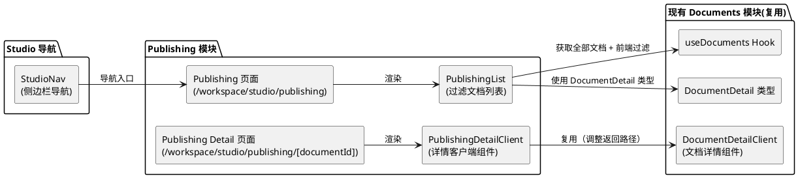
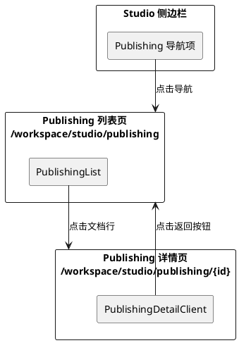

# **1. 实现模型**

## **1.1 上下文视图**

本模块位于 Studio 工作区内，作为 `frontend/src/app/workspace/studio/publishing/` 目录下的新页面模块。它复用现有 Documents 模块的核心能力，仅增加审批状态过滤逻辑和独立的导航路径。

核心思路：**复用 Documents 的数据获取（`useDocuments` hook）、类型定义（`DocumentDetail`）和详情组件（`DocumentDetailClient`），新增 `PublishingList` 组件实现前端过滤，并通过独立的路由路径提供 Publishing 上下文的导航**。



## **1.2 服务/组件总体架构**

### 目录结构

```
frontend/src/app/workspace/studio/publishing/
├── page.tsx                                    # Publishing 列表页（客户端组件）
└── [documentId]/
    ├── page.tsx                                # Publishing 详情页（服务端组件）
    └── publishing-detail-client.tsx             # Publishing 详情客户端组件

frontend/src/components/workspace/studio/
├── publishing-list.tsx                         # PublishingList 组件（新增）
├── studio-nav.tsx                              # Studio 侧边栏导航（修改：新增 Publishing 项）
└── index.ts                                    # 导出（修改：新增 publishing-list 导出）
```

### 组件层次

```
Publishing 列表页 (/workspace/studio/publishing)
└── PublishingList
    ├── Table + TableHeader (Title/Version/Approval Status/RAGFlow Status/Updated)
    └── TableBody
        └── TableRow (每行可点击，链接到 /workspace/studio/publishing/{id})

Publishing 详情页 (/workspace/studio/publishing/[documentId])
└── PublishingDetailClient
    ├── 返回按钮 (→ /workspace/studio/publishing)
    ├── DocumentEditor (复用)
    ├── StudioChatPanel (复用)
    ├── ApprovalPanel (复用，弹窗)
    └── RAGFlowStatusCard (复用，弹窗)
```

## **1.3 实现设计文档**

### 1.3.1 PublishingList 组件（新增）

**职责**：展示审批状态为 `pending_approval` 和 `approved` 的文档列表，表格结构与 `DocumentList` 完全一致。

**核心逻辑**：
- 调用 `useDocuments` hook 获取全部文档数据
- 使用 `Array.filter` 按 `approval_status` 过滤出 `pending_approval` 和 `approved` 状态的文档
- 表格列定义、状态颜色映射、日期格式化与 `DocumentList` 完全一致
- 每行点击跳转到 `/workspace/studio/publishing/{doc.id}`（而非 `/workspace/studio/documents/{doc.id}`）
- 加载中展示骨架屏，错误展示重试按钮，空数据展示空状态提示

**与 DocumentList 的差异**：
- 增加前端过滤逻辑（`approval_status` 过滤）
- 行点击链接路径不同（`/workspace/studio/publishing/` 前缀）
- 不包含"Create Document"按钮（由页面层控制，DocumentList 本身也不包含）

**Props**：无（与 `DocumentList` 一致，无外部 props）

**实现策略**：基于 `DocumentList` 组件的代码结构创建新组件，调整过滤逻辑和链接路径。考虑到 `DocumentList` 不支持 props 配置过滤条件和链接前缀，且代码量较小（约 195 行），创建独立的 `PublishingList` 组件是更清晰的选择，避免过度抽象导致 `DocumentList` 接口复杂化。

### 1.3.2 Publishing 列表页（新增）

**文件**：`frontend/src/app/workspace/studio/publishing/page.tsx`

**职责**：Publishing 列表页面的顶层容器。

**核心逻辑**：
- 标记 `"use client"`
- 页面标题："Publishing"
- 页面副标题："View documents pending approval and approved for publication"
- 不提供"Create Document"按钮（与 Documents 页面的关键差异）
- 渲染 `PublishingList` 组件

### 1.3.3 Publishing 详情页（新增）

**文件**：`frontend/src/app/workspace/studio/publishing/[documentId]/page.tsx`

**职责**：服务端组件，解析路由参数并渲染客户端详情组件。

**核心逻辑**：
- 与现有 `documents/[documentId]/page.tsx` 结构一致
- 解析 `documentId` 路由参数
- `documentId` 为空时调用 `notFound()`
- 渲染 `PublishingDetailClient` 组件

### 1.3.4 PublishingDetailClient 组件（新增）

**文件**：`frontend/src/app/workspace/studio/publishing/[documentId]/publishing-detail-client.tsx`

**职责**：Publishing 上下文的文档详情客户端组件，复用现有 `DocumentDetailClient` 的全部功能，仅调整返回导航路径。

**核心逻辑**：
- 与现有 `document-detail-client.tsx` 结构和功能完全一致
- **唯一差异**：返回按钮的链接从 `/workspace/studio/documents` 改为 `/workspace/studio/publishing`
- 复用 `DocumentEditor`、`StudioChatPanel`、`ApprovalPanel`、`RAGFlowStatusCard` 等组件

**实现策略**：基于现有 `document-detail-client.tsx` 创建新文件，仅修改返回按钮的 `href` 属性。考虑到返回路径是硬编码在组件中的，且详情页组件代码量较小（约 110 行），创建独立组件是合理的选择。

### 1.3.5 StudioNav 导航更新（修改）

**文件**：`frontend/src/components/workspace/studio/studio-nav.tsx`

**修改内容**：
- 在 `navItems` 数组中 "Documents" 项之后新增 "Publishing" 导航项
- 图标：使用 `Send` 图标（来自 `lucide-react`，表示"发布/发送"语义）
- 标签：`"Publishing"`
- 链接：`/workspace/studio/publishing`
- 激活条件：`pathname.startsWith("/workspace/studio/publishing")`

### 1.3.6 Studio 组件导出更新（修改）

**文件**：`frontend/src/components/workspace/studio/index.ts`

**修改内容**：
- 新增 `export * from "./publishing-list"` 导出

---

# **2. 接口设计**

## **2.1 总体设计**

Publishing 模块**不新增任何 API 端点**，完全复用现有 Documents API。数据过滤在前端完成。

接口调用链路：
```
PublishingList → useDocuments Hook → listDocuments API → GET /api/v1/documents → 前端 filter
PublishingDetailClient → 复用 Document Detail 的全部 Hooks 和 API
```

## **2.2 接口清单**

### 复用的现有 API 端点

| API 函数 | HTTP 端点 | 用途 | 调用时机 |
|---|---|---|---|
| `listDocuments` | `GET /api/v1/documents` | 获取全部文档列表 | Publishing 列表页加载时 |
| `getDocument` | `GET /api/v1/documents/{id}` | 获取文档详情 | Publishing 详情页加载时 |
| `updateDocument` | `PUT /api/v1/documents/{id}` | 更新文档内容 | 编辑器保存时 |
| `submitApproval` | `POST /api/v1/documents/{id}/submit-approval` | 提交审批 | 审批面板操作时 |
| `approveDocument` | `POST /api/v1/documents/{id}/approve` | 批准文档 | 审批面板操作时 |
| `rejectDocument` | `POST /api/v1/documents/{id}/reject` | 拒绝文档 | 审批面板操作时 |
| `getRagflowStatus` | `GET /api/v1/documents/{id}/ragflow-status` | 获取 RAGFlow 状态 | RAGFlow 面板操作时 |
| `retryRagflow` | `POST /api/v1/documents/{id}/ragflow-retry` | 重试 RAGFlow 索引 | RAGFlow 面板操作时 |

### 复用的现有 React Query Hooks

| Hook | Query Key | 用途 |
|---|---|---|
| `useDocuments` | `["article-studio", "documents"]` | 获取全部文档列表 |
| `useDocument` | `["article-studio", "documents", id]` | 获取单个文档详情 |
| `useUpdateDocument` | - | 更新文档 mutation |
| `useSubmitApproval` | - | 提交审批 mutation |
| `useApproveDocument` | - | 批准文档 mutation |
| `useRejectDocument` | - | 拒绝文档 mutation |
| `useRagflowStatus` | `["article-studio", "documents", id, "ragflow-status"]` | 获取 RAGFlow 状态 |
| `useRetryRagflow` | - | 重试 RAGFlow mutation |

### 组件 Props 接口

```typescript
// PublishingList - 无 Props（与 DocumentList 一致）
// PublishingList()

// PublishingDetailClient
interface PublishingDetailClientProps {
  documentId: string;
}
```

---

# **3. 路由设计**

## **3.1 路由表**

| 路由路径 | 页面文件 | 组件 | 说明 |
|---|---|---|---|
| `/workspace/studio/publishing` | `app/workspace/studio/publishing/page.tsx` | `PublishingList` | Publishing 文档列表页 |
| `/workspace/studio/publishing/[documentId]` | `app/workspace/studio/publishing/[documentId]/page.tsx` | `PublishingDetailClient` | Publishing 文档详情页 |

## **3.2 路由导航关系**



---

# **4. 数据模型**

## **4.1 设计目标**

数据模型设计遵循以下原则：
1. **零新增类型**：完全复用 `@/core/studio/types` 中已定义的 `DocumentDetail` 类型，不新增任何类型定义
2. **前端过滤**：使用 `Array.filter` 在客户端完成过滤，不引入新的 API 参数或后端变更
3. **数据一致性**：Publishing 列表和 Documents 列表共享相同的 React Query 缓存（`["article-studio", "documents"]`），避免重复请求

## **4.2 过滤逻辑**

```typescript
// PublishingList 中的过滤逻辑
const PUBLISHING_STATUSES = ["pending_approval", "approved"] as const;

const { data: documents, isLoading, error, refetch } = useDocuments();

const publishingDocuments = documents?.filter((doc) =>
  PUBLISHING_STATUSES.includes(doc.approval_status)
);
```

## **4.3 复用的现有类型**

- `DocumentDetail`：文档详情类型（来自 `@/core/studio/types`）
- `approval_status`：`"draft" | "pending_approval" | "approved" | "rejected"`
- `ragflow_status`：`"not_indexed" | "queued" | "indexing" | "indexed" | "failed" | "stale"`

## **4.4 状态颜色映射（与 DocumentList 一致）**

| approval_status | 颜色 | 标签 |
|---|---|---|
| pending_approval | `bg-yellow-500` | Pending Approval |
| approved | `bg-green-500` | Approved |

| ragflow_status | 颜色 | 标签 |
|---|---|---|
| not_indexed | `bg-gray-500` | Not Indexed |
| queued | `bg-blue-500` | Queued |
| indexing | `bg-blue-500` | Indexing |
| indexed | `bg-green-500` | Indexed |
| failed | `bg-red-500` | Failed |
| stale | `bg-orange-500` | Stale |

---

# **5. 复用策略**

## **5.1 完全复用的组件**

| 组件 | 来源 | 用途 |
|---|---|---|
| `DocumentEditor` | `@/components/workspace/studio` | 文档富文本编辑器 |
| `StudioChatPanel` | `@/components/workspace/studio/chat` | AI 对话面板 |
| `ApprovalPanel` | `@/components/workspace/studio` | 审批操作面板 |
| `RAGFlowStatusCard` | `@/components/workspace/studio` | RAGFlow 状态卡片 |
| `Table/TableHeader/TableBody/TableRow/TableCell/TableHead` | `@/components/ui/table` | 表格 UI 组件 |
| `Button` | `@/components/ui/button` | 按钮组件 |
| `Skeleton` | `@/components/ui/skeleton` | 骨架屏组件 |
| `Dialog/DialogContent/DialogHeader/DialogTitle` | `@/components/ui/dialog` | 弹窗组件 |

## **5.2 完全复用的 Hooks**

| Hook | 来源 | 用途 |
|---|---|---|
| `useDocuments` | `@/core/studio/hooks/use-documents` | 获取文档列表 |
| `useDocument` | `@/core/studio/hooks/use-documents` | 获取文档详情 |
| `useUpdateDocument` | `@/core/studio/hooks/use-documents` | 更新文档 |
| `useSubmitApproval` | `@/core/studio/hooks/use-documents` | 提交审批 |
| `useApproveDocument` | `@/core/studio/hooks/use-documents` | 批准文档 |
| `useRejectDocument` | `@/core/studio/hooks/use-documents` | 拒绝文档 |

## **5.3 新增的文件**

| 文件 | 类型 | 说明 |
|---|---|---|
| `app/workspace/studio/publishing/page.tsx` | 新增 | Publishing 列表页 |
| `app/workspace/studio/publishing/[documentId]/page.tsx` | 新增 | Publishing 详情页（服务端组件） |
| `app/workspace/studio/publishing/[documentId]/publishing-detail-client.tsx` | 新增 | Publishing 详情客户端组件 |
| `components/workspace/studio/publishing-list.tsx` | 新增 | PublishingList 组件 |

## **5.4 修改的文件**

| 文件 | 修改内容 | 影响范围 |
|---|---|---|
| `components/workspace/studio/studio-nav.tsx` | 新增 Publishing 导航项 | Studio 侧边栏 |
| `components/workspace/studio/index.ts` | 新增 `publishing-list` 导出 | Studio 组件导出 |
