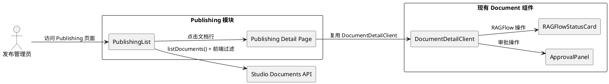
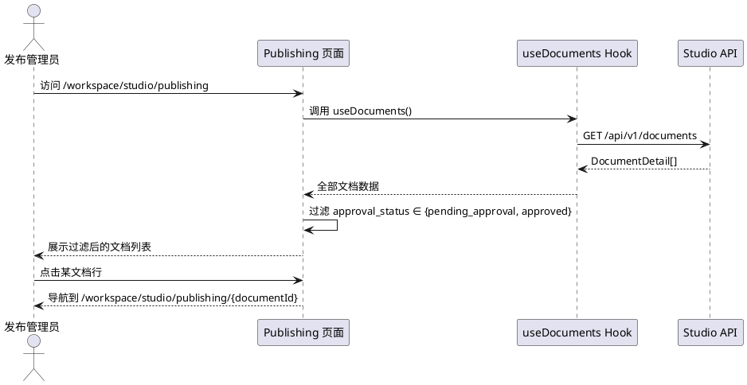
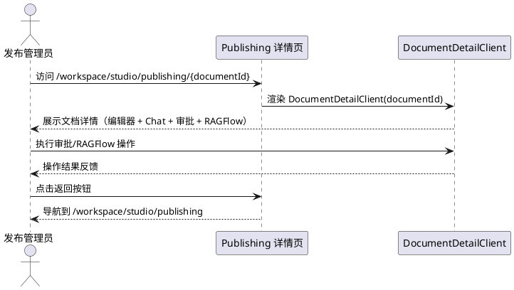
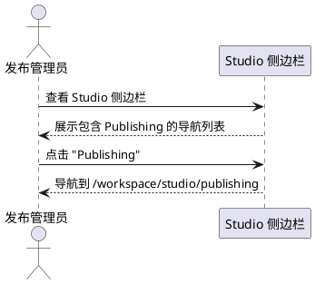

# **1. 组件定位**

## **1.1 核心职责**

本组件负责在 Studio 工作区内提供"发布管理"页面功能，展示审批状态为 `pending_approval`（待审批）和 `approved`（已审批）的文档列表，并支持从列表进入文档详情页进行查看和操作，实现文档发布流程的集中管理。

## **1.2 核心输入**

1. **文档列表数据**：通过现有 `listDocuments` API 获取的全部文档数据，前端按 `approval_status` 过滤出 `pending_approval` 和 `approved` 状态的文档
2. **文档详情访问**：用户从 Publishing 列表点击某条文档，进入该文档的详情页
3. **导航入口**：用户通过 Studio 侧边栏的 "Publishing" 导航项进入 Publishing 页面

## **1.3 核心输出**

1. **过滤后的文档列表**：仅包含 `pending_approval` 和 `approved` 状态的文档，以表格形式展示
2. **文档详情页**：复用现有 Document Detail 组件，提供完整的文档查看、编辑、审批和 RAGFlow 操作能力
3. **导航入口**：Studio 侧边栏新增 "Publishing" 导航项

## **1.4 职责边界**

1. 本组件**不负责**文档数据的获取逻辑（复用现有 `listDocuments` API 和 `useDocuments` hook）
2. 本组件**不负责**文档详情页的实现（完全复用现有 Document Detail 组件）
3. 本组件**不负责**审批和 RAGFlow 操作的后端逻辑（复用现有 API 和组件）
4. 本组件**不负责**文档创建功能（Publishing 页面不提供"Create Document"按钮）
5. 本组件**仅负责**按审批状态过滤文档列表展示，以及提供从 Publishing 上下文进入文档详情的导航路径

---

# **2. 领域术语**

**Publishing**
: 文档发布管理模块，聚焦于处于审批流程中（`pending_approval`）和已通过审批（`approved`）的文档，为发布流程提供集中视图。

**Approval Status**
: 文档的审批状态，取值范围为 `draft` | `pending_approval` | `approved` | `rejected`。Publishing 模块仅关注 `pending_approval` 和 `approved` 两种状态。

**Publishing Document**
: 满足 Publishing 过滤条件的文档，即 `approval_status` 为 `pending_approval` 或 `approved` 的 DocumentDetail 实例。

---

# **3. 角色与边界**

## **3.1 核心角色**

- **发布管理员**：通过 Publishing 页面查看待审批和已审批文档，并进入文档详情执行审批/拒绝/编辑等操作的用户

## **3.2 外部系统**

- **Studio Documents API**：提供文档列表和详情的 REST API（`/api/v1/documents`），Publishing 模块复用该 API
- **Studio Documents 组件**：提供 DocumentList、DocumentEditor、ApprovalPanel、RAGFlowStatusCard 等现有组件，Publishing 模块复用这些组件

## **3.3 交互上下文**

---

# **4. DFX约束**

## **4.1 性能**

1. Publishing 列表页首屏加载时间必须与现有 Documents 列表页一致（复用相同 API 和数据获取逻辑）
2. 前端过滤操作必须在客户端同步完成，不引入额外网络请求

## **4.2 可靠性**

1. 当 `listDocuments` API 返回错误时，Publishing 列表必须展示与 DocumentList 一致的错误状态和重试按钮
2. 当过滤后结果为空时，必须展示空状态提示

## **4.3 可维护性**

1. Publishing 模块必须最大程度复用现有 Documents 模块的组件和逻辑，避免代码重复
2. Publishing 列表与 DocumentList 的表格列定义、状态颜色映射、日期格式化必须保持一致

## **4.4 兼容性**

1. Publishing 详情页必须与现有 Document Detail 页面行为完全一致
2. Publishing 模块必须兼容现有 Studio 导航结构

---

# **5. 核心能力**

## **5.1 Publishing 文档列表**

### **5.1.1 业务规则**

1. **数据获取规则**：Publishing 列表必须通过现有 `useDocuments` hook 获取全部文档数据，然后在前端按 `approval_status` 过滤

   a. 验收条件：[用户访问 Publishing 页面] → [调用 `useDocuments` hook 获取全部文档，前端过滤出 `approval_status` 为 `pending_approval` 或 `approved` 的文档并展示]

2. **状态过滤规则**：列表仅展示 `approval_status` 为 `pending_approval` 或 `approved` 的文档，`draft` 和 `rejected` 状态的文档不展示

   a. 验收条件：[文档列表中存在 draft/rejected/pending_approval/approved 四种状态的文档] → [Publishing 列表仅展示 pending_approval 和 approved 状态的文档]

3. **表格列规则**：Publishing 列表的表格列必须与 DocumentList 一致，包含 Title、Version、Approval Status、RAGFlow Status、Updated 五列

   a. 验收条件：[Publishing 列表渲染完成] → [表格包含 Title、Version、Approval Status、RAGFlow Status、Updated 五列，列宽和样式与 DocumentList 一致]

4. **状态颜色规则**：Approval Status 和 RAGFlow Status 的颜色映射必须与 DocumentList 一致

   a. 验收条件：[文档 approval_status 为 pending_approval] → [显示黄色圆点 + "Pending Approval" 标签]；[文档 approval_status 为 approved] → [显示绿色圆点 + "Approved" 标签]

5. **行点击导航规则**：用户点击 Publishing 列表中的文档行，必须跳转到 `/workspace/studio/publishing/{documentId}` 详情页

   a. 验收条件：[用户点击 Publishing 列表中某文档的 Title/Version/Status/Updated 任意列] → [浏览器导航到 `/workspace/studio/publishing/{documentId}`]

6. **加载状态规则**：数据加载中时，必须展示与 DocumentList 一致的骨架屏（Skeleton）

   a. 验收条件：[useDocuments hook 处于 loading 状态] → [Publishing 列表展示 5 行骨架屏，列结构与 DocumentList 一致]

7. **错误状态规则**：数据加载失败时，必须展示错误提示和重试按钮

   a. 验收条件：[useDocuments hook 返回 error] → [展示 "Failed to load documents" 提示和 Retry 按钮]

8. **空状态规则**：过滤后无文档时，必须展示空状态提示

   a. 验收条件：[全部文档的 approval_status 均为 draft 或 rejected] → [展示空状态图标和 "No documents found" 提示]

9. **禁止项**：Publishing 列表页不提供"Create Document"按钮

   a. 验收条件：[Publishing 列表页渲染完成] → [页面不包含"Create Document"按钮或创建文档的入口]

### **5.1.2 交互流程**

### **5.1.3 异常场景**

1. **API 返回错误**

   a. 触发条件：`listDocuments` API 请求失败（网络错误或服务端 5xx）

   b. 系统行为：展示错误提示 "Failed to load documents" 和 Retry 按钮，点击 Retry 重新调用 `useDocuments` hook 的 `refetch` 方法

   c. 用户感知：看到错误提示，可点击 Retry 重试

2. **过滤后无结果**

   a. 触发条件：所有文档的 `approval_status` 均为 `draft` 或 `rejected`

   b. 系统行为：展示空状态图标和 "No documents found" 提示

   c. 用户感知：看到空状态提示，了解当前无待发布文档

## **5.2 Publishing 文档详情**

### **5.2.1 业务规则**

1. **详情页复用规则**：Publishing 文档详情页必须复用现有 `DocumentDetailClient` 组件，保持与 Documents 详情页完全一致的功能和交互

   a. 验收条件：[用户从 Publishing 列表进入文档详情] → [详情页展示与 /workspace/studio/documents/{documentId} 一致的布局和功能，包含 DocumentEditor、StudioChatPanel、ApprovalPanel、RAGFlowStatusCard]

2. **返回导航规则**：详情页顶部的返回按钮必须链接回 `/workspace/studio/publishing`（而非 `/workspace/studio/documents`）

   a. 验收条件：[用户在 Publishing 详情页点击返回按钮] → [浏览器导航到 `/workspace/studio/publishing`]

3. **审批操作规则**：详情页的审批操作（提交审批、批准、拒绝）必须与 Documents 详情页行为一致

   a. 验收条件：[用户在 Publishing 详情页执行审批操作] → [调用相同的审批 API，操作结果与 Documents 详情页一致]

4. **RAGFlow 操作规则**：详情页的 RAGFlow 操作必须与 Documents 详情页行为一致

   a. 验收条件：[用户在 Publishing 详情页执行 RAGFlow 操作] → [调用相同的 RAGFlow API，操作结果与 Documents 详情页一致]

### **5.2.2 交互流程**

### **5.2.3 异常场景**

1. **文档 ID 无效**

   a. 触发条件：URL 中的 `documentId` 不存在或为空

   b. 系统行为：返回 404 页面（与现有 Document Detail 页面行为一致）

   c. 用户感知：看到 404 页面

## **5.3 Studio 导航更新**

### **5.3.1 业务规则**

1. **导航项新增规则**：Studio 侧边栏必须新增 "Publishing" 导航项

   a. 验收条件：[Studio 侧边栏渲染完成] → [侧边栏包含 Templates、Create、Jobs、Documents、Publishing 五个导航项]

2. **导航项位置规则**："Publishing" 导航项必须位于 "Documents" 导航项之后

   a. 验收条件：[Studio 侧边栏导航项顺序] → [顺序为 Templates → Create → Jobs → Documents → Publishing]

3. **导航项激活规则**：当当前路径以 `/workspace/studio/publishing` 开头时，"Publishing" 导航项必须处于激活状态

   a. 验收条件：[用户访问 /workspace/studio/publishing 或 /workspace/studio/publishing/{documentId}] → [Publishing 导航项高亮显示]

4. **导航项链接规则**："Publishing" 导航项的链接目标必须为 `/workspace/studio/publishing`

   a. 验收条件：[用户点击 Publishing 导航项] → [浏览器导航到 `/workspace/studio/publishing`]

5. **导航项图标规则**："Publishing" 导航项必须使用合适的图标（如 `Send` 或 `Upload` 图标，表示"发布"语义）

   a. 验收条件：[Publishing 导航项渲染完成] → [导航项包含图标和 "Publishing" 文字标签]

### **5.3.2 交互流程**

### **5.3.3 异常场景**

无特殊异常场景，导航行为与现有导航项一致。

---

# **6. 数据约束**

## **6.1 Publishing 文档过滤条件**

1. **approval_status 过滤值**：仅包含 `pending_approval` 和 `approved` 两个值
2. **过滤方式**：前端过滤，在 `useDocuments` hook 返回数据后，通过 `Array.filter` 方法按 `approval_status` 字段过滤
3. **过滤不改变数据结构**：过滤后的每条数据仍为完整的 `DocumentDetail` 类型实例

## **6.2 页面路由**

1. **列表页路由**：`/workspace/studio/publishing`
2. **详情页路由**：`/workspace/studio/publishing/[documentId]`，其中 `documentId` 为文档的唯一标识符（UUID 格式）

## **6.3 导航配置**

1. **导航项标签**：`"Publishing"`
2. **导航项链接**：`/workspace/studio/publishing`
3. **导航项激活条件**：`pathname.startsWith("/workspace/studio/publishing")`
4. **导航项位置**：在 "Documents" 导航项之后
