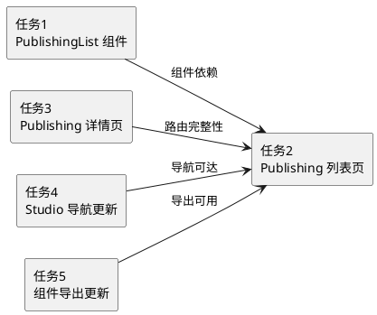

# Publishing 页面功能 - 编码任务

## 任务依赖关系

---

## 任务 1：创建 PublishingList 组件

**优先级**：P0（核心组件，其他任务依赖）

**描述**：在 `frontend/src/components/workspace/studio/` 目录下新建 `publishing-list.tsx` 文件，实现 `PublishingList` 组件。该组件基于现有 `DocumentList` 的代码结构，增加 `approval_status` 前端过滤逻辑，并将行点击链接路径改为 `/workspace/studio/publishing/{doc.id}`。

**输入**：
- 现有 `DocumentList` 组件代码（`frontend/src/components/workspace/studio/document-list.tsx`）
- 现有 `useDocuments` hook（`frontend/src/core/studio/hooks/use-documents.ts`）
- 现有 `DocumentDetail` 类型（`frontend/src/core/studio/types.ts`）

**输出**：
- 新文件 `frontend/src/components/workspace/studio/publishing-list.tsx`

**实现步骤**：
1. 创建 `publishing-list.tsx` 文件，标记 `"use client"`
2. 从 `lucide-react` 导入 `FileText`、`RefreshCw` 图标
3. 从 `next/link` 导入 `Link`
4. 从 `@/components/ui/button` 导入 `Button`
5. 从 `@/components/ui/skeleton` 导入 `Skeleton`
6. 从 `@/components/ui/table` 导入 `Table`、`TableBody`、`TableCell`、`TableHead`、`TableHeader`、`TableRow`
7. 从 `@/core/studio` 导入 `useDocuments`
8. 从 `date-fns` 导入 `formatDistanceToNow`
9. 定义 `PUBLISHING_STATUSES` 常量数组，包含 `"pending_approval"` 和 `"approved"`
10. 复制 `DocumentList` 中的 `approvalStatusColors`、`ragflowStatusColors`、`approvalStatusLabels`、`ragflowStatusLabels`、`formatSafeDate` 定义
11. 实现 `PublishingList` 函数组件：
    - 调用 `useDocuments()` 获取 `{ data: documents, isLoading, error, refetch }`
    - 对 `documents` 执行 `filter`，仅保留 `approval_status` 在 `PUBLISHING_STATUSES` 中的文档，结果赋值给 `publishingDocuments`
    - 加载状态：展示与 `DocumentList` 一致的 5 行骨架屏
    - 错误状态：展示 "Failed to load documents" 提示和 Retry 按钮
    - 空状态：展示 `FileText` 图标和 "No documents found" 提示
    - 数据状态：渲染表格，表头为 Title/Version/Approval Status/RAGFlow Status/Updated
    - 表格行遍历 `publishingDocuments`，每行所有 `Link` 组件的 `href` 使用 `/workspace/studio/publishing/${doc.id}` 前缀
12. 导出 `PublishingList` 函数

**验收条件**：
- [ ] `publishing-list.tsx` 文件存在且标记 `"use client"`
- [ ] 组件仅展示 `approval_status` 为 `pending_approval` 或 `approved` 的文档
- [ ] 表格列与 `DocumentList` 一致（Title/Version/Approval Status/RAGFlow Status/Updated）
- [ ] 状态颜色映射与 `DocumentList` 一致
- [ ] 行点击链接指向 `/workspace/studio/publishing/{doc.id}`
- [ ] 加载中展示骨架屏，错误展示重试按钮，空数据展示空状态提示

**代码生成提示**：
基于 `document-list.tsx` 的完整代码结构创建 `publishing-list.tsx`，核心变更点：(1) 新增 `PUBLISHING_STATUSES` 常量和 `filter` 逻辑；(2) 所有 `Link` 的 `href` 从 `/workspace/studio/documents/${doc.id}` 改为 `/workspace/studio/publishing/${doc.id}`；(3) 遍历的数组从 `documents` 改为 `publishingDocuments`。

---

## 任务 2：创建 Publishing 列表页

**优先级**：P0（页面入口）

**描述**：在 `frontend/src/app/workspace/studio/publishing/` 目录下新建 `page.tsx` 文件，实现 Publishing 列表页面。页面包含标题"Publishing"、副标题"View documents pending approval and approved for publication"，以及 `PublishingList` 组件。不提供"Create Document"按钮。

**输入**：
- 任务 1 产出的 `PublishingList` 组件
- 现有 Documents 列表页代码（`frontend/src/app/workspace/studio/documents/page.tsx`）作为参考

**输出**：
- 新文件 `frontend/src/app/workspace/studio/publishing/page.tsx`

**实现步骤**：
1. 创建目录 `frontend/src/app/workspace/studio/publishing/`
2. 创建 `page.tsx` 文件，标记 `"use client"`
3. 从 `@/components/workspace/studio` 导入 `PublishingList`
4. 实现 `PublishingPage` 默认导出函数组件：
    - 外层 `div`，class 为 `flex size-full flex-col`
    - 页面头部区域：左侧包含 `h1` "Publishing" 和 `p` 副标题，右侧无按钮（与 Documents 页面的差异：无 Create Document 按钮）
    - 内容区域：渲染 `PublishingList` 组件

**验收条件**：
- [ ] 访问 `/workspace/studio/publishing` 路由可正常渲染页面
- [ ] 页面标题为 "Publishing"
- [ ] 页面包含副标题说明文字
- [ ] 页面不包含 "Create Document" 按钮
- [ ] 页面渲染 `PublishingList` 组件

**代码生成提示**：
参考 `documents/page.tsx` 的结构，移除 `useState`、`Plus` 图标、`Button`、`Dialog`、`ArticleCreateForm` 等创建文档相关的导入和逻辑，仅保留页面头部（标题+副标题）和 `PublishingList` 渲染。

---

## 任务 3：创建 Publishing 详情页

**优先级**：P0（详情页入口）

**描述**：在 `frontend/src/app/workspace/studio/publishing/[documentId]/` 目录下新建服务端页面组件 `page.tsx` 和客户端详情组件 `publishing-detail-client.tsx`，实现 Publishing 文档详情页。详情页复用现有 `DocumentDetailClient` 的全部功能，仅将返回按钮链接改为 `/workspace/studio/publishing`。

### 子任务 3.1：创建服务端页面组件

**输入**：
- 现有 `documents/[documentId]/page.tsx` 作为参考

**输出**：
- 新文件 `frontend/src/app/workspace/studio/publishing/[documentId]/page.tsx`

**实现步骤**：
1. 创建目录 `frontend/src/app/workspace/studio/publishing/[documentId]/`
2. 创建 `page.tsx` 文件（服务端组件，不标记 `"use client"`）
3. 从 `next/navigation` 导入 `notFound`
4. 从同目录导入 `PublishingDetailClient`
5. 定义 `PublishingDetailPageProps` 接口，包含 `params: Promise<{ documentId: string }>`
6. 实现默认导出的 `async` 函数组件：
    - 解构 `params` 获取 `documentId`
    - `documentId` 为空时调用 `notFound()`
    - 返回 `<PublishingDetailClient documentId={documentId} />`

**验收条件**：
- [ ] `page.tsx` 为服务端组件（无 `"use client"` 标记）
- [ ] 正确解析 `documentId` 路由参数
- [ ] `documentId` 为空时返回 404

### 子任务 3.2：创建客户端详情组件

**输入**：
- 现有 `document-detail-client.tsx` 作为参考
- 现有 `DocumentEditor`、`ApprovalPanel`、`RAGFlowStatusCard`、`StudioChatPanel` 组件

**输出**：
- 新文件 `frontend/src/app/workspace/studio/publishing/[documentId]/publishing-detail-client.tsx`

**实现步骤**：
1. 创建 `publishing-detail-client.tsx` 文件，标记 `"use client"`
2. 从 `lucide-react` 导入 `ArrowLeft`、`CheckCircle`、`Database`
3. 从 `next/link` 导入 `Link`
4. 从 `react` 导入 `useCallback`、`useState`
5. 从 `@/components/ui/button` 导入 `Button`
6. 从 `@/components/ui/dialog` 导入 `Dialog`、`DialogContent`、`DialogHeader`、`DialogTitle`
7. 从 `@/components/workspace/studio` 导入 `DocumentEditor`、`ApprovalPanel`、`RAGFlowStatusCard`
8. 从 `@/components/workspace/studio/chat` 导入 `StudioChatPanel`
9. 从 `@/core/studio/types/runtime` 导入 `ApplyMode` 类型
10. 实现 `PublishingDetailClient` 函数组件，接收 `{ documentId: string }` props：
    - 状态管理：`approvalDialogOpen`、`ragflowDialogOpen`、`editorDirty`
    - `onApplyRequest` 回调：与现有 `document-detail-client.tsx` 一致
    - 返回按钮 `Link` 的 `href` 设为 `/workspace/studio/publishing`（**唯一差异点**）
    - 其余布局和组件复用与 `document-detail-client.tsx` 完全一致

**验收条件**：
- [ ] `publishing-detail-client.tsx` 文件存在且标记 `"use client"`
- [ ] 返回按钮链接指向 `/workspace/studio/publishing`
- [ ] 详情页包含 DocumentEditor、StudioChatPanel、ApprovalPanel、RAGFlowStatusCard
- [ ] 审批和 RAGFlow 操作与 Documents 详情页行为一致

**代码生成提示**：
基于 `document-detail-client.tsx` 的完整代码创建 `publishing-detail-client.tsx`，唯一变更点：返回按钮的 `<Link href="/workspace/studio/documents">` 改为 `<Link href="/workspace/studio/publishing">`。组件名从 `DocumentDetailClient` 改为 `PublishingDetailClient`。

---

## 任务 4：更新 Studio 侧边栏导航

**优先级**：P1（导航入口，不影响核心功能但影响可达性）

**描述**：修改 `frontend/src/components/workspace/studio/studio-nav.tsx`，在 `navItems` 数组中 "Documents" 项之后新增 "Publishing" 导航项。

**输入**：
- 现有 `studio-nav.tsx` 代码

**输出**：
- 修改文件 `frontend/src/components/workspace/studio/studio-nav.tsx`

**实现步骤**：
1. 在 `lucide-react` 导入中新增 `Send` 图标
2. 在 `navItems` 数组中 "Documents" 项之后新增一个对象：
    - `icon: Send`
    - `label: "Publishing"`
    - `href: "/workspace/studio/publishing"`
    - `isActive: pathname.startsWith("/workspace/studio/publishing")`

**验收条件**：
- [ ] Studio 侧边栏包含 "Publishing" 导航项
- [ ] "Publishing" 导航项位于 "Documents" 之后
- [ ] 点击 "Publishing" 导航到 `/workspace/studio/publishing`
- [ ] 访问 `/workspace/studio/publishing` 或其子路径时，"Publishing" 导航项高亮
- [ ] 导航项使用 `Send` 图标

**代码生成提示**：
在 `studio-nav.tsx` 中：(1) 将 `import { FileText, Layers, ListTodo, PenTool }` 改为 `import { FileText, Layers, ListTodo, PenTool, Send }`；(2) 在 `navItems` 数组的 Documents 项（`icon: FileText, label: "Documents"`）之后插入新项 `{ icon: Send, label: "Publishing", href: "/workspace/studio/publishing", isActive: pathname.startsWith("/workspace/studio/publishing") }`。

---

## 任务 5：更新 Studio 组件导出

**优先级**：P1（模块导出完整性）

**描述**：修改 `frontend/src/components/workspace/studio/index.ts`，新增 `publishing-list` 的导出，使 `PublishingList` 组件可通过 `@/components/workspace/studio` 路径导入。

**输入**：
- 现有 `index.ts` 代码

**输出**：
- 修改文件 `frontend/src/components/workspace/studio/index.ts`

**实现步骤**：
1. 在 `index.ts` 的导出列表中新增一行：`export * from "./publishing-list";`
2. 建议放置在 `document-list` 导出之后，保持逻辑分组

**验收条件**：
- [ ] `index.ts` 包含 `export * from "./publishing-list"` 导出
- [ ] 通过 `@/components/workspace/studio` 可正确导入 `PublishingList`

**代码生成提示**：
在 `index.ts` 中 `export * from "./document-list";` 行之后新增 `export * from "./publishing-list";`。
