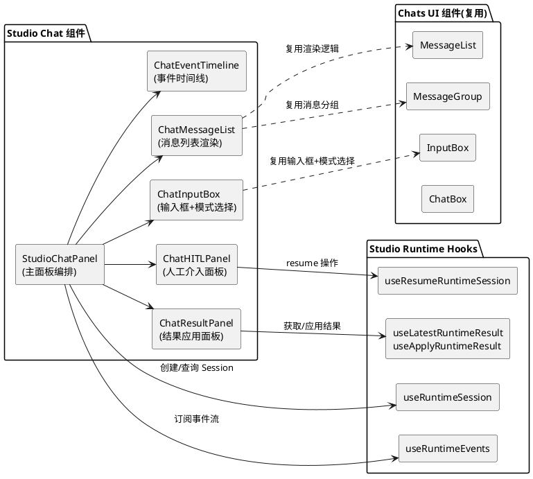

# **1. 实现模型**

## **1.1 上下文视图**

本组件位于 Studio 工作区内，作为 `frontend/src/components/workspace/studio/chat/` 目录下的独立模块。它桥接了两个现有体系：

- **Chats 体系**（`frontend/src/app/workspace/chats/`）：提供对话式交互 UI（消息列表、输入框、Artifacts 面板）
- **Studio Runtime 体系**（`frontend/src/components/workspace/studio/runtime/`）：提供运行时会话管理、HITL 交互、结果应用

核心思路：**复用 Chats 的 UI 组件（消息渲染、输入框、Artifacts），但将底层数据流从 LangGraph SDK 的 `useStream` 切换为 Studio Runtime API（`useRuntimeSession` + `useRuntimeEvents`）**。



## **1.2 服务/组件总体架构**

### 目录结构

```
frontend/src/components/workspace/studio/chat/
├── index.ts                        # 导出
├── StudioChatPanel.tsx             # 主面板编排组件
├── ChatMessageList.tsx             # 消息列表（基于 Runtime Events 渲染）
├── ChatInputBox.tsx                # 输入框（集成模式选择+Session Run 启动）
├── ChatHITLPanel.tsx               # 人工介入面板（复用 RuntimeInterruptPanel 逻辑）
├── ChatResultPanel.tsx             # 结果应用面板（复用 RuntimeResultPanel 逻辑）
├── ChatEventTimeline.tsx           # 事件时间线（复用 RuntimeTimeline）
├── ChatStatusCard.tsx              # 状态卡片（复用 RuntimeStatusCard）
├── hooks/
│   ├── index.ts
│   ├── use-chat-session.ts         # 封装 Session 创建/查询/Run 启动
│   ├── use-chat-events.ts          # 封装事件订阅+消息提取
│   └── use-chat-message-send.ts    # 封装消息发送逻辑（optimistic + startRuntimeRun）
└── types.ts                        # Chat 专用类型定义
```

### 组件层次

```
StudioChatPanel
├── ChatStatusCard          (Session 状态展示)
├── ChatMessageList         (消息列表，从 Runtime Events 提取消息)
│   ├── MessageGroup        (复用 chats 的消息分组渲染)
│   └── StreamingIndicator  (流式指示器)
├── ChatHITLPanel           (HITL 操作面板，waiting_human 时显示)
├── ChatResultPanel         (结果应用面板，completed 时显示)
├── ChatEventTimeline       (事件时间线，可折叠)
└── ChatInputBox            (输入框 + 模式/模型选择 + 发送/停止)
```

## **1.3 实现设计文档**

### 1.3.1 StudioChatPanel（主面板编排）

**职责**：作为顶层容器，编排所有子组件，管理 Session 生命周期。

**核心逻辑**：
- 接收 `ownerType` 和 `ownerId` 作为 props
- 使用 `useRuntimeSession` 创建/获取 Session
- 使用 `useRuntimeEvents` 订阅事件流
- 从 events 中提取消息列表传递给 `ChatMessageList`
- 检测 Session 状态变化，控制 HITL/Result 面板的显隐
- 管理 Request Context（模式、模型、推理强度），持久化到 localStorage

**Props**：
```typescript
interface StudioChatPanelProps {
  ownerType: "job" | "document";
  ownerId: string;
  autoCreate?: boolean;           // 默认 true
  documentId?: string;            // 结果应用目标文档 ID
  isDocumentDirty?: boolean;
  onApplyRequest?: (applyMode: ApplyMode) => Promise<boolean>;
}
```

### 1.3.2 ChatMessageList（消息列表）

**职责**：从 Runtime Events 中提取并渲染对话消息。

**核心逻辑**：
- 接收 `events: RuntimeEvent[]` 作为 props
- 过滤出 `message_delta` / `message_final` / `tool_call` / `tool_result` 类型的事件
- 将事件转换为 `Message[]` 格式（兼容 Chats 的 MessageGroup 渲染逻辑）
- 复用 `MessageGroup` 组件渲染消息（human/ai/tool_call/reasoning）
- 底部显示 `StreamingIndicator`（当 Session 状态为 streaming 时）

**关键转换逻辑**：
- `message_delta` 事件 → 追加到当前 AI 消息的文本内容
- `message_final` 事件 → 完成当前 AI 消息
- `tool_call` 事件 → 渲染工具调用卡片
- `tool_result` 事件 → 渲染工具结果
- `interrupt` 事件 → 标记中断点（不直接渲染，由 HITL 面板处理）

### 1.3.3 ChatInputBox（输入框）

**职责**：提供消息输入、模式选择、发送/停止控制。

**核心逻辑**：
- 复用 `InputBox` 组件的 UI 结构（模式选择、模型选择、推理强度、文件附件）
- 发送逻辑：调用 `startRuntimeRun(sessionId, { message, requestContext })` 而非 LangGraph SDK 的 `thread.submit()`
- 停止逻辑：调用 Session 取消 API（或标记本地停止）
- streaming 状态下禁用发送、显示停止按钮
- Request Context 变更时更新本地配置

**与原 InputBox 的差异**：
- 底层调用从 `thread.submit()` 改为 `startRuntimeRun()`
- 不使用 `useThreadStream`，而是通过 props 接收 `onSubmit` 和 `onStop` 回调
- optimistic 消息由 `use-chat-message-send` hook 管理

### 1.3.4 ChatHITLPanel（人工介入面板）

**职责**：当 Session 状态为 `waiting_human` 时展示 HITL 操作面板。

**实现策略**：直接复用 `RuntimeInterruptPanel` 组件，无需重新实现。该组件已完整支持批准/拒绝/修改/自定义 JSON 四种操作。

### 1.3.5 ChatResultPanel（结果应用面板）

**职责**：当 Session 完成且存在物化结果时展示结果预览和应用操作。

**实现策略**：直接复用 `RuntimeResultPanel` 组件，无需重新实现。该组件已完整支持替换/追加/新版本三种应用方式。

### 1.3.6 ChatEventTimeline（事件时间线）

**职责**：展示运行过程中的所有事件。

**实现策略**：直接复用 `RuntimeTimeline` 组件，包装为可折叠面板。

### 1.3.7 Hooks 设计

#### use-chat-session.ts

封装 Session 生命周期管理：

```typescript
function useChatSession(params: {
  ownerType: "job" | "document";
  ownerId: string;
  autoCreate?: boolean;
}) {
  // 委托 useRuntimeSession
  // 额外提供: ensureSessionAndRun(message, context) 便捷方法
  return {
    session,          // RuntimeSession | null
    sessionId,        // string | null
    isLoading,
    error,
    ensureSessionAndRun,  // (message, context) => Promise<void>
  };
}
```

#### use-chat-events.ts

封装事件订阅和消息提取：

```typescript
function useChatEvents(sessionId: string | undefined) {
  // 委托 useRuntimeEvents
  // 额外提供: messages (从 events 提取的 Message[])
  return {
    events,          // RuntimeEvent[]
    messages,        // Message[] (从 events 转换)
    isLive,
    reconnect,
  };
}
```

#### use-chat-message-send.ts

封装消息发送逻辑（含 optimistic）：

```typescript
function useChatMessageSend(params: {
  sessionId: string | undefined;
  ensureSessionAndRun: (message: string, context: RuntimeRequestContext) => Promise<void>;
}) {
  // 管理 optimisticMessages
  // 提供 sendMessage(threadId, message) 方法
  return {
    optimisticMessages,  // Message[]
    isSending,
    sendMessage,         // (threadId, message) => Promise<void>
    stop,                // () => void
  };
}
```

---

# **2. 接口设计**

## **2.1 总体设计**

Studio Chat 组件**不直接调用** DeerFlow Gateway API，所有接口调用通过 Studio Backend API 间接完成。前端通过 `@/core/studio/api/` 模块调用后端 REST/SSE 端点，后端通过 `DeerFlowAdapter` 调用 DeerFlow Gateway。

接口调用链路：
```
StudioChatPanel → Studio Runtime Hooks → Studio API Client → Studio Backend API → DeerFlowAdapter → DeerFlow Gateway
```

## **2.2 接口清单**

### 前端调用的 Studio Backend API 端点

| API 函数 | HTTP 端点 | 用途 | 调用时机 |
|---|---|---|---|
| `createRuntimeSession` | `POST /api/v1/runtime/sessions` | 创建 Runtime Session | 首次发送消息时自动创建 |
| `getRuntimeSession` | `GET /api/v1/runtime/sessions/{id}` | 查询 Session 状态 | 轮询（streaming/waiting_human 时 3s 间隔） |
| `startRuntimeRun` | `POST /api/v1/runtime/sessions/{id}/runs` | 启动 AI 运行 | 用户发送消息时 |
| `listRuntimeEvents` | `GET /api/v1/runtime/sessions/{id}/events` | 获取事件列表 | 初始加载 + 轮询降级 |
| `openRuntimeEventStream` | `GET /api/v1/runtime/sessions/{id}/stream` | SSE 事件流 | 实时订阅（优先） |
| `resumeRuntimeSession` | `POST /api/v1/runtime/sessions/{id}/resume` | HITL 恢复 | 用户执行批准/拒绝/修改/自定义操作 |
| `getLatestRuntimeResult` | `GET /api/v1/runtime/sessions/{id}/results/latest` | 获取最新结果 | Session 完成后轮询（5s 间隔） |
| `applyRuntimeResultToDocument` | `POST /api/v1/documents/{id}/runtime-results/{rid}/apply` | 应用结果到文档 | 用户选择替换/追加/新版本 |

### 后端 DeerFlowAdapter 调用的 Gateway 端点

| Adapter 方法 | HTTP 端点 | 用途 |
|---|---|---|
| `create_thread()` | `POST {base}/api/langgraph/threads` | 创建 LangGraph Thread |
| `start_run_stream()` | `POST {base}/api/threads/{tid}/runs/stream` | 启动流式运行（SSE） |
| `resume_run_stream()` | `POST {base}/api/threads/{tid}/runs/stream` | 恢复流式运行（SSE） |
| `get_thread_state()` | `GET {base}/api/langgraph/threads/{tid}/state` | 获取 Thread 状态 |
| `get_thread_history()` | `POST {base}/api/langgraph/threads/{tid}/history` | 获取 Thread 历史 |

### 组件 Props 接口

```typescript
// StudioChatPanel Props
interface StudioChatPanelProps {
  ownerType: "job" | "document";
  ownerId: string;
  autoCreate?: boolean;
  documentId?: string;
  isDocumentDirty?: boolean;
  onApplyRequest?: (applyMode: ApplyMode) => Promise<boolean>;
}

// ChatMessageList Props
interface ChatMessageListProps {
  events: RuntimeEvent[];
  sessionStatus: RuntimeSessionStatus;
  className?: string;
}

// ChatInputBox Props
interface ChatInputBoxProps {
  sessionId: string | undefined;
  sessionStatus: RuntimeSessionStatus;
  requestContext: RuntimeRequestContext;
  onContextChange: (context: RuntimeRequestContext) => void;
  onSubmit: (message: string) => Promise<void>;
  onStop: () => void;
  disabled?: boolean;
}
```

---

# **4. 数据模型**

## **4.1 设计目标**

数据模型设计遵循以下原则：
1. **最大化复用**：直接使用 `@/core/studio/types/runtime` 中已定义的类型，不重复定义
2. **消息转换层**：新增 `ChatMessage` 类型作为 Runtime Event 到 UI 渲染的中间转换层
3. **配置持久化**：Request Context 使用现有的 `useThreadSettings` / localStorage 机制

## **4.2 模型实现**

### 复用的现有类型（来自 `@/core/studio/types/runtime`）

- `RuntimeSession`：Session 详情
- `RuntimeEvent`：运行时事件
- `RuntimeRequestContext`：请求上下文
- `RuntimeSessionStatus`：Session 状态枚举
- `RuntimeEventType`：事件类型枚举
- `RuntimeInterrupt`：中断信息
- `ApplyMode`：结果应用方式
- `ResumeActionType`：HITL 操作类型

### 新增类型（`types.ts`）

```typescript
import type { Message } from "@langchain/langgraph-sdk";
import type { RuntimeEvent, RuntimeSessionStatus } from "@/core/studio/types/runtime";

/** 从 Runtime Events 提取的对话消息（兼容 Chats MessageGroup 渲染） */
export interface ChatMessage {
  id: string;
  type: "human" | "ai" | "system";
  content: string;
  timestamp: string;
  toolCalls?: ChatToolCall[];
  reasoningContent?: string;
  isStreaming?: boolean;
}

/** 工具调用摘要 */
export interface ChatToolCall {
  name: string;
  args?: Record<string, unknown>;
  result?: unknown;
}

/** Chat 面板本地状态 */
export interface ChatPanelState {
  requestContext: RuntimeRequestContext;
  showTimeline: boolean;
  showFollowups: boolean;
}
```

### 消息转换映射

| Runtime Event Type | 转换目标 |
|---|---|
| `message_delta` (source=human) | `ChatMessage { type: "human", isStreaming: true }` |
| `message_delta` (source=ai) | `ChatMessage { type: "ai", isStreaming: true }` |
| `message_final` (source=human) | `ChatMessage { type: "human", isStreaming: false }` |
| `message_final` (source=ai) | `ChatMessage { type: "ai", isStreaming: false }` |
| `tool_call` | `ChatToolCall` 追加到当前 AI 消息 |
| `tool_result` | 更新对应 `ChatToolCall.result` |
| `interrupt` | 不生成 ChatMessage，由 HITL 面板处理 |
| `error` | `ChatMessage { type: "system", content: error message }` |
