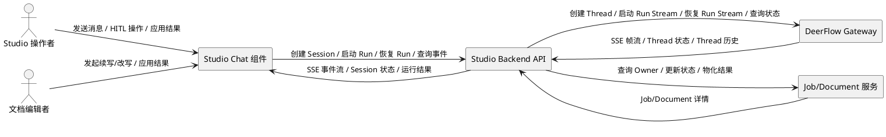
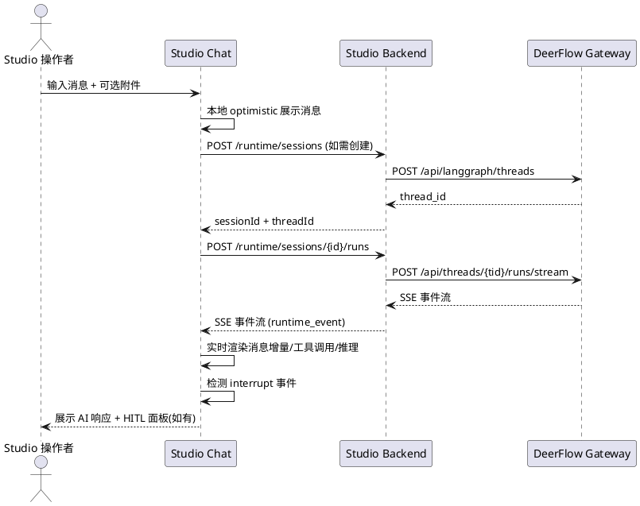
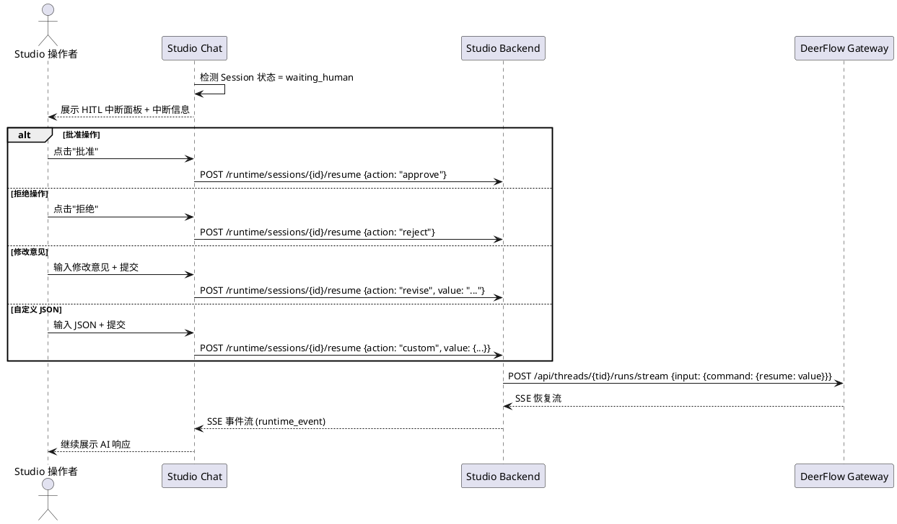
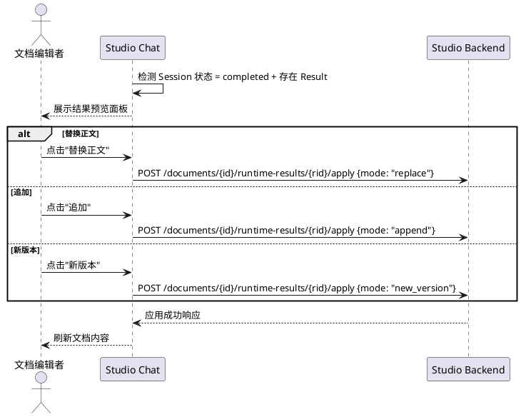
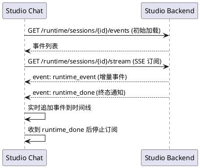
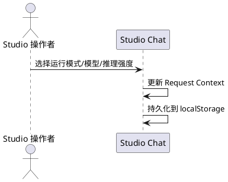

# **1. 组件定位**

## **1.1 核心职责**

本组件负责在 Studio 工作区内提供基于对话的会议生成与人工介入交互能力，实现通过聊天方式驱动 AI 生成内容并在关键节点支持人工审批/修正的完整工作流。

## **1.2 核心输入**

1. **用户消息输入**：用户在聊天输入框中输入的文本消息和文件附件，用于发起或继续对话
2. **人工介入操作指令**：当 AI 运行中断等待人工决策时，用户提交的批准/拒绝/修改/自定义 resume 操作
3. **运行结果应用指令**：用户对 AI 生成结果的选择性应用操作（替换/追加/新版本）
4. **会话配置参数**：模型名称、运行模式（flash/thinking/pro/ultra）、推理强度、是否启用思考/计划/子代理等上下文参数
5. **Runtime Session 创建请求**：从 Studio Job 或 Document 发起的运行时会话创建信号

## **1.3 核心输出**

1. **流式消息响应**：AI 生成内容的实时流式输出，包含文本增量、工具调用、推理过程等
2. **人工介入请求通知**：当 AI 运行到达中断点时，向前端推送等待人工决策的状态和中断信息
3. **运行结果物化输出**：AI 运行完成后的最终生成结果，可应用到关联文档
4. **事件时间线**：运行过程中的所有事件记录（run_start、message_delta、tool_call、interrupt、run_end 等）
5. **会话状态更新**：Runtime Session 的状态流转（idle → streaming → waiting_human → completed/failed）

## **1.4 职责边界**

1. 本组件**不负责**文档编辑器的实现（由 document-editor 组件承担）
2. 本组件**不负责**模板管理和 Job 创建的完整流程（由 template-list、article-create-form 等组件承担）
3. 本组件**不负责**底层 LangGraph/DeerFlow Gateway 的直接调用（由后端 RuntimeAdapter 承担）
4. 本组件**不负责**消息的持久化存储（由后端 checkpointer 和 MongoDB 承担）
5. 本组件**不负责**跨线程/跨会话的管理（由上层 Studio 导航承担）

---

# **2. 领域术语**

**Runtime Session**
: 一次 AI 运行的会话实例，绑定到特定的 owner（Job 或 Document），拥有唯一的 sessionId 和 threadId，生命周期包含 idle/streaming/waiting_human/completed/failed/cancelled 状态。

**Thread**
: LangGraph 的线程概念，代表一次完整的对话上下文，包含消息历史和状态快照，由 DeerFlow Gateway 管理。

**HITL（Human-in-the-Loop）**
: 人工介入机制，当 AI 运行到达预设中断点时暂停执行，等待人工提供决策（批准/拒绝/修改/自定义输入）后恢复运行。

**Interrupt**
: AI 运行中的中断事件，携带中断类型和描述信息，触发 HITL 流程。

**Resume**
: HITL 恢复操作，人工提交决策后，AI 运行从中断点继续执行。

**Runtime Event**
: 运行时事件的统称，包括 run_start、message_delta、message_final、tool_call、tool_result、interrupt、resume、run_end、error、result_materialized 等类型。

**SSE（Server-Sent Events）**
: 服务端推送事件流，用于实时传输 AI 运行过程中的增量事件。

**Runtime Result**
: AI 运行完成后的物化结果，包含生成的文本内容，可应用到关联文档。

**Apply Mode**
: 结果应用方式，包含 replace（替换正文）、append（追加）、new_version（新版本）三种模式。

**Request Context**
: 运行请求上下文，包含 modelName、mode、reasoningEffort、thinkingEnabled、planMode、subagentEnabled 等配置参数。

**Owner Type**
: Runtime Session 的归属类型，分为 job（关联到 Job）和 document（关联到 Document）两种。

---

# **3. 角色与边界**

## **3.1 核心角色**

- **Studio 操作者**：在 Studio 工作区内通过聊天方式与 AI 交互的用户，可发送消息、响应 HITL 中断、应用生成结果
- **文档编辑者**：在 Document 模式下发起 AI 续写/改写请求并应用结果到文档的用户

## **3.2 外部系统**

- **DeerFlow Gateway**：提供 LangGraph 兼容的 threads API，负责 thread 创建、run 启动/恢复（SSE 流式）、thread 状态/历史查询
- **Studio Backend API**：提供 Runtime Session 管理、事件持久化与 SSE 推送、HITL 恢复、结果物化与应用等 REST/SSE 端点
- **Studio Job/Document 服务**：提供 Job 和 Document 的查询与状态更新能力

## **3.3 交互上下文**

---

# **4. DFX约束**

## **4.1 性能**

1. SSE 事件流的首事件延迟必须 ≤ 3 秒（从用户发送消息到看到首个 AI 响应增量）
2. HITL 中断检测到前端展示的延迟必须 ≤ 2 秒
3. 事件时间线渲染必须支持 ≥ 500 条事件不卡顿（虚拟滚动或分页加载）
4. SSE 断线后自动降级到轮询模式，轮询间隔 2 秒

## **4.2 可靠性**

1. SSE 连接断线后必须自动重连或降级到轮询，不丢失已产生的事件
2. Runtime Session 状态必须与后端保持最终一致（轮询间隔 3 秒，用于 streaming/waiting_human 状态）
3. 用户发送的消息在服务端确认前必须以 optimistic 方式本地展示
4. HITL 操作（批准/拒绝/修改）必须为幂等操作，重复提交不产生副作用

## **4.3 安全性**

1. 所有 Studio Backend API 调用必须经过认证
2. SSE 连接必须使用 HTTPS
3. 用户上传的文件附件必须经过类型和大小校验

## **4.4 可维护性**

1. Runtime Session 的所有状态流转必须记录事件日志
2. HITL 操作必须记录审计日志（操作类型、操作者、时间戳）
3. SSE 帧解析异常必须记录 debug 级别日志，不中断流消费

## **4.5 兼容性**

1. 前端 API 调用必须兼容 DeerFlow Gateway 的两种路径模式（/api/threads 和 /api/langgraph/threads）
2. Request Context 必须同时支持 camelCase 和 snake_case 字段命名
3. 组件必须兼容 Studio 现有的 Job 和 Document 两种 OwnerType

---

# **5. 核心能力**

## **5.1 对话式消息交互**

### **5.1.1 业务规则**

1. **消息发送规则**：用户输入文本消息后提交，系统必须将消息发送到当前 Runtime Session 关联的 Thread，并启动或继续 AI Run

   a. 验收条件：[用户在输入框输入消息并点击发送] → [消息以 optimistic 方式立即显示在消息列表，同时 AI 开始流式响应]

2. **流式响应规则**：AI 响应必须以 SSE 流式方式实时展示，包含文本增量、工具调用、推理过程等

   a. 验收条件：[AI 开始响应] → [消息列表实时追加 AI 响应内容，显示 streaming 状态指示器]

3. **文件附件规则**：用户可以在消息中附加文件，系统必须先上传文件再将文件引用嵌入消息

   a. 验收条件：[用户选择文件并提交消息] → [文件上传完成后消息包含文件引用，AI 可访问文件内容]

4. **新会话创建规则**：当用户首次发起对话时，系统必须自动创建 Runtime Session 和关联 Thread

   a. 验收条件：[用户在无已有 Session 的上下文中发送首条消息] → [系统自动创建 Session 和 Thread，消息发送到新 Thread]

5. **禁止项**：禁止在 streaming 状态下允许用户发送新消息（应提供停止按钮）

   a. 验收条件：[AI 正在 streaming 响应] → [输入框显示停止按钮，发送按钮禁用]

### **5.1.2 交互流程**

### **5.1.3 异常场景**

1. **SSE 连接中断**

   a. 触发条件：网络波动或服务端重启导致 SSE 连接断开

   b. 系统行为：自动检测断线（watchdog 5 秒无事件），降级到 2 秒间隔轮询模式获取增量事件

   c. 用户感知：消息列表继续更新，状态指示器显示"轮询模式"

2. **DeerFlow Gateway 返回 404**

   a. 触发条件：API 路径不匹配或 Gateway 版本不支持对应端点

   b. 系统行为：自动尝试降级路径（/api/langgraph/ 前缀），若仍失败则返回明确错误信息

   c. 用户感知：显示"运行时服务不可用，请检查 Gateway 配置"

3. **消息发送失败**

   a. 触发条件：网络错误或服务端 5xx 错误

   b. 系统行为：保留 optimistic 消息但标记为发送失败，提供重试选项

   c. 用户感知：消息显示错误状态，可点击重试

## **5.2 人工介入（HITL）交互**

### **5.2.1 业务规则**

1. **中断检测规则**：当 Runtime Session 状态变为 waiting_human 时，系统必须展示 HITL 操作面板

   a. 验收条件：[AI 运行到达 interrupt 节点] → [Session 状态变为 waiting_human，前端展示中断面板]

2. **批准操作规则**：用户选择批准时，系统必须以 resume_value="approve" 恢复运行

   a. 验收条件：[用户点击批准按钮] → [调用 resume API，AI 运行从中断点继续]

3. **拒绝操作规则**：用户选择拒绝时，系统必须以 resume_value="reject" 恢复运行

   a. 验收条件：[用户点击拒绝按钮] → [调用 resume API，AI 运行以拒绝结果继续]

4. **修改意见规则**：用户提交修改意见时，系统必须以 resume_value 包含修改内容恢复运行

   a. 验收条件：[用户在修改输入框中输入意见并提交] → [调用 resume API，修改意见作为 resume_value 传递]

5. **自定义 Resume 规则**：用户可以提交自定义 JSON 作为 resume_value

   a. 验收条件：[用户在 JSON 编辑器中输入合法 JSON 并提交] → [调用 resume API，JSON 作为 resume_value 传递]

6. **禁止项**：禁止在非 waiting_human 状态下展示 HITL 操作面板

   a. 验收条件：[Session 状态为 streaming/completed/failed] → [HITL 操作面板不显示]

### **5.2.2 交互流程**

### **5.2.3 异常场景**

1. **Resume 操作失败**

   a. 触发条件：网络错误或后端处理 resume 请求失败

   b. 系统行为：保持 waiting_human 状态，显示错误提示，允许用户重试

   c. 用户感知：HITL 面板保持显示，出现错误提示"操作失败，请重试"

2. **并发 Resume 操作**

   a. 触发条件：多个用户同时对同一 Session 执行 Resume 操作

   b. 系统行为：后端保证幂等性，首个请求生效，后续请求返回当前状态

   c. 用户感知：操作结果以最终状态为准

## **5.3 运行结果应用**

### **5.3.1 业务规则**

1. **结果展示规则**：当 AI 运行完成且存在物化结果时，系统必须展示结果预览面板

   a. 验收条件：[AI 运行完成 + 存在 Runtime Result] → [展示结果预览面板，包含生成内容摘要]

2. **替换应用规则**：用户选择"替换正文"时，系统必须将生成结果替换文档当前正文内容

   a. 验收条件：[用户点击"替换正文"] → [调用 apply API，mode=replace，文档正文被替换]

3. **追加应用规则**：用户选择"追加"时，系统必须将生成结果追加到文档正文末尾

   a. 验收条件：[用户点击"追加"] → [调用 apply API，mode=append，内容追加到文档末尾]

4. **新版本应用规则**：用户选择"新版本"时，系统必须基于生成结果创建文档新版本

   a. 验收条件：[用户点击"新版本"] → [调用 apply API，mode=new_version，创建文档新版本]

5. **脏文档确认规则**：当文档存在未保存修改时，应用结果前必须弹出确认对话框

   a. 验收条件：[文档有未保存修改 + 用户点击应用] → [弹出确认对话框"文档有未保存修改，是否继续？" ]

6. **禁止项**：禁止在 Session 非 completed 状态下展示结果应用面板

   a. 验收条件：[Session 状态非 completed] → [结果应用面板不显示]

### **5.3.2 交互流程**

### **5.3.3 异常场景**

1. **结果应用失败**

   a. 触发条件：后端应用结果到文档时发生错误

   b. 系统行为：保持结果面板显示，显示错误提示

   c. 用户感知：显示"应用结果失败，请重试"

2. **文档已被他人修改**

   a. 触发条件：应用结果时文档版本与预期不一致

   b. 系统行为：提示版本冲突，建议用户刷新后重试

   c. 用户感知：显示"文档已被修改，请刷新后重试"

## **5.4 运行时事件时间线**

### **5.4.1 业务规则**

1. **事件实时展示规则**：运行过程中的所有事件必须按序实时展示在时间线中

   a. 验收条件：[后端产生 runtime_event] → [事件实时追加到时间线列表]

2. **事件类型展示规则**：不同事件类型必须使用不同的图标和颜色标识

   a. 验收条件：[事件类型为 error] → [显示红色错误图标]；[事件类型为 run_start] → [显示蓝色启动图标]

3. **SSE 实时订阅规则**：事件时间线必须优先通过 SSE 实时获取事件，断线后降级到轮询

   a. 验收条件：[SSE 连接正常] → [事件实时推送]；[SSE 断线] → [降级到 2 秒轮询]

4. **运行完成通知规则**：收到 runtime_done 事件时，必须停止 SSE 订阅和轮询

   a. 验收条件：[收到 runtime_done 事件] → [停止事件订阅，时间线显示最终状态]

### **5.4.2 交互流程**

### **5.4.3 异常场景**

1. **SSE 流中断**

   a. 触发条件：SSE 连接断开

   b. 系统行为：watchdog 5 秒无事件后降级到轮询，每 2 秒获取增量事件

   c. 用户感知：时间线继续更新，无数据丢失

## **5.5 会话配置与模式选择**

### **5.5.1 业务规则**

1. **运行模式选择规则**：用户必须能在 flash/thinking/pro/ultra 四种模式间切换

   a. 验收条件：[用户选择不同模式] → [Request Context 中 mode 字段更新为对应值]

2. **模型选择规则**：用户必须能选择 AI 模型

   a. 验收条件：[用户从模型下拉框选择模型] → [Request Context 中 modelName 字段更新]

3. **推理强度选择规则**：用户必须能在 minimal/low/medium/high 四档推理强度间切换

   a. 验收条件：[用户选择推理强度] → [Request Context 中 reasoningEffort 字段更新]

4. **配置持久化规则**：用户的会话配置必须持久化到本地存储

   a. 验收条件：[用户修改配置后刷新页面] → [配置恢复为上次选择的值]

### **5.5.2 交互流程**

### **5.5.3 异常场景**

1. **配置值无效**

   a. 触发条件：localStorage 中的配置值被手动修改为无效值

   b. 系统行为：回退到默认配置值

   c. 用户感知：配置显示为默认值，无错误提示

---

# **6. 数据约束**

## **6.1 RuntimeSession**

1. **sessionId**：全局唯一标识，由后端生成，格式为 UUID
2. **ownerType**：取值范围为 "job" 或 "document"，标识 Session 归属类型
3. **ownerId**：关联的 Job 或 Document 的唯一标识
4. **threadId**：关联的 LangGraph Thread 唯一标识，由 DeerFlow Gateway 生成
5. **status**：取值范围为 idle | streaming | waiting_human | completed | failed | cancelled
6. **currentInterrupt**：当 status 为 waiting_human 时必填，包含中断类型和描述信息
7. **summary**：可选，Session 的摘要信息

## **6.2 RuntimeEvent**

1. **eventId**：全局唯一标识，由后端生成
2. **seq**：事件序号，同一 Session 内严格递增
3. **eventType**：取值范围为 run_start | message_delta | message_final | tool_call | tool_result | value_snapshot | custom_event | subgraph_event | interrupt | resume | run_end | error | result_materialized | document_persisted
4. **source**：事件来源标识
5. **display**：事件的展示信息，包含 title、content、severity 等
6. **createdAt**：事件创建时间戳，ISO 8601 格式

## **6.3 Request Context**

1. **modelName**：AI 模型名称，如 "gpt-4o"，必填
2. **mode**：运行模式，取值范围为 flash | thinking | pro | ultra，必填
3. **reasoningEffort**：推理强度，取值范围为 minimal | low | medium | high，必填
4. **thinkingEnabled**：是否启用思考模式，布尔值，必填
5. **planMode**：是否启用计划模式，布尔值，必填
6. **subagentEnabled**：是否启用子代理，布尔值，必填

## **6.4 ResumePayload**

1. **action**：HITL 操作类型，取值范围为 approve | reject | revise | custom，必填
2. **value**：当 action 为 revise 时为字符串修改意见；当 action 为 custom 时为合法 JSON 对象；当 action 为 approve/reject 时可为空

## **6.5 ApplyPayload**

1. **resultId**：要应用的 Runtime Result 唯一标识，必填
2. **documentId**：目标 Document 唯一标识，必填
3. **mode**：应用方式，取值范围为 replace | append | new_version，必填
