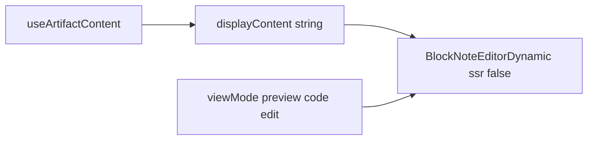

# BlockNote Markdown 编辑模式实现计划

## 范围与约束（来自 PRD）

- **可改**：[frontend/package.json](frontend/package.json)、[frontend/src/styles/globals.css](frontend/src/styles/globals.css)、新建 [frontend/src/components/ai-elements/blocknote-editor.tsx](frontend/src/components/ai-elements/blocknote-editor.tsx)、[frontend/src/components/workspace/artifacts/artifact-file-detail.tsx](frontend/src/components/workspace/artifacts/artifact-file-detail.tsx)。
- **禁止**：`backend/`**、`frontend/src/core/artifacts/hooks.ts`、`code-editor.tsx`、`next.config.`*、保存/回写、`ArtifactFilePreview` 内 Markdown 分支（Streamdown）逻辑。

## 当前代码要点

- [artifact-file-detail.tsx](frontend/src/components/workspace/artifacts/artifact-file-detail.tsx)：`viewMode` 为 `"code" | "preview"`；`ToggleGroup` 仅在 `isSupportPreview`（markdown/html）时显示两项；默认模式由 `useEffect` 依赖 `**[isSupportPreview]`** 设置。
- **与 PRD 的缺口**：两个均为 Markdown 的 artifact 切换时，`isSupportPreview` 不变，**不会**重置 `viewMode`，违反「切换文件不得保留 edit」。实现时须把 `**filepathFromProps`（或等价 filepath）** 加入该 effect 的依赖数组，使每次换文件都重新执行默认逻辑（可预览 → `preview`，否则 → `code`）。
- 该组件由已带 `"use client"` 的 [page.tsx](frontend/src/app/workspace/chats/[thread_id]/page.tsx) 间接引入，可在本文件内使用 `next/dynamic`，无需强行加 `"use client"`（除非 ESLint/构建要求显式声明）。

## 实现步骤

### 1. 安装依赖

在 `frontend` 下执行：

`pnpm add @blocknote/core @blocknote/react @blocknote/shadcn`

（避免手写 `"latest"`；以 lockfile 为准。若与 React 19 有类型/运行时报错，按 PRD 仅记录风险，不改 `next.config`。）

### 2. Tailwind v4 扫描 BlockNote Shadcn 包

在 [frontend/src/styles/globals.css](frontend/src/styles/globals.css) 顶部 `@import` / 现有 `@source` 区域，**仅新增一行**（与现有 `streamdown` 的 `@source` 风格一致）：

```css
@source "../node_modules/@blocknote/shadcn";
```

路径相对于 `src/styles/globals.css`，与 PRD 一致。

### 3. 新建 `blocknote-editor.tsx`

路径：[frontend/src/components/ai-elements/blocknote-editor.tsx](frontend/src/components/ai-elements/blocknote-editor.tsx)

- 文件首行 `"use client"`。
- CSS：`@blocknote/core/fonts/inter.css`、`@blocknote/shadcn/style.css`（按 PRD）。
- 使用 `useCreateBlockNote`（`@blocknote/react`）与 `BlockNoteView`（`@blocknote/shadcn`）。
- **Props**：`BlockNoteEditorProps` — `markdown: string`，`className?`，`editable?`（默认 `true`）；**不**暴露 `onChange`。
- **导入 Markdown**：在 `useEffect` 中 `await editor.tryParseMarkdownToBlocks(markdown)`，再 `editor.replaceBlocks(editor.document, blocks)`；用 `useRef` 记录上次已灌入的 `markdown` 字符串，避免 StrictMode/重渲染导致重复替换；`markdown` 变化时（含换文件）允许重新导入。
- 将 `editable` 传给 editor 选项（以当前 BlockNote API 为准，例如 `useCreateBlockNote({ editable, ... })` 或等价 API，以实现 `editable={!isWriteFile}`）。

### 4. 修改 `artifact-file-detail.tsx`

**4.1 `next/dynamic`（ssr: false）**

- `import dynamic from "next/dynamic"`。
- `const BlockNoteEditorDynamic = dynamic(() => import("@/components/ai-elements/blocknote-editor").then((m) => ({ default: m.BlockNoteEditor })), { ssr: false });`

**4.2 状态与 effect**

- `viewMode` 类型改为 `"code" | "preview" | "edit"`。
- 默认模式 `useEffect`：逻辑保持「可预览 → preview，否则 → code」，依赖改为 `**[isSupportPreview, filepathFromProps]`**（或同时依赖能唯一标识当前文件的变量），满足 PRD「换文件重置」。

**4.3 ToggleGroup**

- **HTML**：仍为 `code` / `preview` 两项；`onValueChange` 类型断言包含 `"code" | "preview"`。
- **Markdown**（含 `.skill` 视为 markdown）：三项 `code` / `preview` / `edit`；可选用 [zh-CN/en-US 已有 `t.common.code | preview | edit](frontend/src/core/i18n/locales/zh-CN.ts)` 做 `title`/无障碍说明（可选，PRD未强制）。
- 图标：第三项可用 `Pencil` / `PenLine` 等 lucide 图标，与现有 `Code2` / `Eye` 风格一致。

**4.4 主内容区渲染**

保持现有 preview（`ArtifactFilePreview` + Streamdown）与 code（`CodeEditor`）分支不变。

新增分支（与 PRD 一致）：

```tsx
{isCodeFile && language === "markdown" && viewMode === "edit" && (
  <ArtifactContent className="min-h-0">
    <BlockNoteEditorDynamic
      markdown={displayContent ?? ""}
      className="size-full"
      editable={!isWriteFile}
    />
  </ArtifactContent>
)}
```

注意与现有外层 `<ArtifactContent className="p-0">` 的嵌套关系：若内层再包 `ArtifactContent` 会与 PRD示例一致；若项目里 `ArtifactContent` 语义为单层容器，可改为 `div` + `min-h-0` + `size-full`，以不破坏布局为准（实现时在组件内看 [artifact.tsx](frontend/src/components/ai-elements/artifact.tsx) 的 flex/高度约定）。

**4.5 挂载条件**

严格保证 BlockNote 仅在 `isCodeFile && language === "markdown" && viewMode === "edit"` 时渲染（dynamic 组件也只在 `edit` 时进入树），避免无谓初始化。

### 5. 验收命令

在 `frontend` 目录执行 PRD 要求：

`pnpm typecheck && pnpm lint && pnpm build`

## 数据流（示意）




## 风险备忘（PRD 已列）

- React 19 / StrictMode 与 BlockNote 的兼容性仅通过 client + dynamic 缓解；不修改 `next.config`。
- Markdown 与 Block 互转为 lossy；用户仍可通过 `code` 视图看原文。

