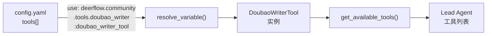

# Doubao Writer Tool 实现计划

## 背景

根据 [tool_doubao_write.md](docs_prd/tool_doubao_write.md) 需求文档，在 DeerFlow Harness 层（`deerflow.community`）新增一个可配置的写作工具 `doubao_writer_tool`，调用 Doubao Chat Completions API 生成中文内容。工具通过 `config.yaml` 的 `tools[]` 配置项注入 Agent。

## 实现范围

仅涉及 Harness 层新增文件和配置更新，**不修改**主模型工厂、中间件、Gateway API、MCP 逻辑或前端。

## 文件清单

### 新建文件（3 个）

1. **[backend/packages/harness/deerflow/community/tools/doubao_writer.py](backend/packages/harness/deerflow/community/tools/doubao_writer.py)** — 工具核心实现
  - `DoubaoWriterInput(BaseModel)` — 输入 schema（prompt, system_prompt, temperature, max_tokens）
  - `DoubaoWriterTool(BaseTool)` — 继承 `BaseTool`，实现 `_run` 方法
  - `doubao_writer_tool` — 模块级实例变量
  - 环境变量：`DOUBAO_API_KEY`（必填）、`DOUBAO_MODEL`（必填）、`DOUBAO_BASE_URL`（可选）、`DOUBAO_TIMEOUT_SECONDS`（可选，默认 120）
  - 使用 `httpx.Client` 发送 POST 请求（`httpx>=0.28.0` 已在 harness 依赖中）
  - 错误统一返回 `DOUBAO_ERROR: ...` 前缀字符串
2. **[backend/packages/harness/deerflow/community/tools/init.py](backend/packages/harness/deerflow/community/tools/__init__.py)** — 包导出
  - 导出 `doubao_writer_tool`
3. **[backend/tests/test_doubao_writer_tool.py](backend/tests/test_doubao_writer_tool.py)** — 单元测试（5 个场景）
  - 缺少 API Key → 返回 `DOUBAO_ERROR: missing DOUBAO_API_KEY`
  - 缺少模型 ID → 返回 `DOUBAO_ERROR: missing DOUBAO_MODEL`
  - 接口正常返回 → Mock httpx，返回正文字符串
  - 接口超时 → 返回 `DOUBAO_ERROR: request timeout`
  - 接口返回空内容 → 返回 `DOUBAO_ERROR: empty content returned by doubao api`

### 修改文件（1 个）

1. **[config.example.yaml](config.example.yaml)** — 添加注释示例
  - 在 `tool_groups` 区域添加 `writing` 分组（注释）
  - 在 `tools` 区域添加 doubao_writer_tool 配置示例（注释）

## 关键设计决策

- **遵循 BaseTool 子类模式**：PRD 明确要求继承 `BaseTool` 而非使用 `@tool` 装饰器，与社区工具中的部分模式一致
- **路径为 `deerflow.community.tools.doubao_writer`**：PRD 指定的路径，config.yaml 中的 `use` 为 `deerflow.community.tools.doubao_writer:doubao_writer_tool`
- **纯字符串输出**：成功返回生成文本，失败返回 `DOUBAO_ERROR:` 前缀错误信息，不返回 dict/bytes
- **无需新增依赖**：`httpx`、`pydantic`、`langchain_core` 均已在 harness 的 pyproject.toml 中

## 工具加载流程

用户在 `config.yaml` 中取消注释 doubao_writer_tool 配置项后，`get_available_tools()` 会通过 `resolve_variable()` 动态加载该工具实例，无需修改任何核心加载逻辑。