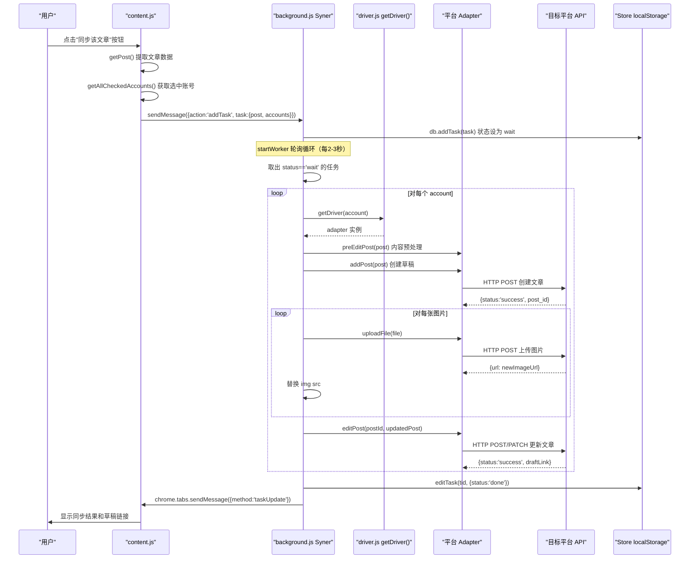
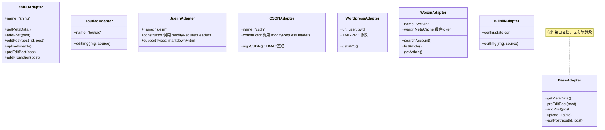

# Wechatsync 源码级架构分析

> **重要前置说明**：用户提问中提到的 `packages/core`、`packages/mcp-server`、`packages/cli`、`skills/wechatsync`、WebSocket 桥接、MCP Server 等模块**在当前仓库中均不存在**。当前仓库（`wechatsync/Wechatsync` master 分支）是一个**纯 Chrome 扩展 + 适配器驱动库**的 Monorepo 项目。以下分析严格基于实际源码。

---

## 1. 项目定位与总体结论

### 1.1 产品形态

Wechatsync 当前仓库是一个**单纯的 Chrome 浏览器扩展**，附带一个可独立构建的适配器驱动库（`@wechatsync/drivers`）。**不存在** core SDK、CLI、MCP Server、OpenClaw 集成等组件。 [1](#0-0) 

仓库中的 workspace 配置为：
```json
"workspaces": [
  "packages/*",
  "packages/@wechatsync/*"
]
```

### 1.2 真正执行"同步发布"的核心动作发生在哪一层？

**在 `packages/web-extension/src/background.js` 的 `Syner.doSync()` 方法中**。这是唯一的同步执行入口，运行在 Chrome 扩展的 background page 中。 [2](#0-1) 

同步流程为：`doSync()` → `driver.preEditPost()` → `driver.addPost()` → 循环 `upImage()` → `driver.editPost()`。 [3](#0-2) 

### 1.3 各层职责

| 层 | 实际存在 | 职责 |
|---|---|---|
| `@wechatsync/drivers` | ✅ | 平台适配器集合，定义各平台的 API 调用逻辑 |
| `web-extension` | ✅ | Chrome 扩展壳，提供 background 同步引擎、UI、运行时沙箱、header 修改 |
| `articleapi` | ✅ | 实验性 Node 端调用尝试（极简，未完成） |
| `mcp-server` | ❌ | 不存在 |
| `cli` | ❌ | 不存在 |
| `core` | ❌ | 不存在（`@wechatsync/drivers` 是最接近的等价物） |

### 1.4 最小可复用单元

**`packages/@wechatsync/drivers`** 是最小可复用单元。它是一个独立的 JS 模块，包含所有平台适配器类。但它**强依赖浏览器运行时环境**（`$`/jQuery、`DOMParser`、`document`、`Blob`、`FormData`、`chrome.webRequest` 等），无法直接在纯 Node.js 环境中运行。 [4](#0-3) 

`packages/articleapi` 是一个尝试在 Node 端复用 drivers 的实验，但仅有一个 `index.js` 调用 `getDriver({type:'zhihu'})` 的示例，且依赖 `jsdom`，**未完成**。 [5](#0-4) 

---

## 2. Monorepo 结构拆解

### 2.1 目录总览

```
wechatsync/Wechatsync/
├── packages/
│   ├── @wechatsync/
│   │   └── drivers/          # 平台适配器库（核心）
│   ├── web-extension/        # Chrome 扩展
│   ├── articleapi/           # Node 端实验（未完成）
│   ├── driver-devtool/       # 适配器在线开发工具
│   └── markdown-editor/      # Markdown 编辑器页面
├── bundle/                   # 预构建的 driver 代码
├── docs/                     # 开发教程
├── intergrations/            # PHP XML-RPC 集成示例
├── tools/                    # 批量同步 HTML 工具页
└── package.json              # Monorepo 根配置（yarn workspaces）
``` [6](#0-5) 

### 2.2 Package 级职责表

| package | 作用 | 输入 | 输出 | 依赖谁 | 是否可脱离浏览器运行 | 二开价值 |
|---|---|---|---|---|---|---|
| `@wechatsync/drivers` | 平台适配器集合 + 工具函数 | account 对象、post 对象 | API 调用结果（草稿链接等） | jQuery, axios, turndown, juice, CryptoJS, md5（均通过 scopes 注入） | ❌ 强依赖 `$`, `DOMParser`, `document`, `Blob`, `FormData` | ⭐⭐⭐⭐⭐ 核心复用目标 |
| `web-extension` | Chrome 扩展主体 | 用户操作、网页内容 | 同步任务执行、状态通知 | `@wechatsync/drivers`, Vue 2, Element UI, Sval, PouchDB | ❌ 完全依赖 Chrome Extension API | ⭐⭐⭐ 可作为参考架构 |
| `articleapi` | Node 端调用实验 | 硬编码的 account | console 输出 | `@wechatsync/drivers`, jsdom | ⚠️ 理论上可以但未完成 | ⭐ 仅作参考 |
| `driver-devtool` | 在线适配器开发调试工具 | 用户编写的适配器代码 | 部署到扩展 | web-extension（通过 postMessage） | ❌ | ⭐⭐ 开发辅助 |
| `markdown-editor` | Markdown 编辑器 | Markdown 文本 | HTML 内容 | mavon-editor | ❌ | ⭐ | [7](#0-6) 

### 2.3 构建方式

- **根目录**：`yarn install`（yarn workspaces），无 pnpm-workspace.yaml [8](#0-7) 

- **web-extension**：Webpack 5，入口文件包括 `background.js`, `popup.js`, `content.js`, `page.js`, `api.js`, `viewer.js`, `editor.js` 等，输出到 `dist/` [9](#0-8) 

- **@wechatsync/drivers**：独立 Webpack 构建，输出到 `dist/index.js` [10](#0-9) 

---

## 3. 核心架构与调用链路

### 3.1 架构图

```mermaid
graph TD
    subgraph "Chrome Extension"
        subgraph "Background Page"
            BG["background.js - Syner 类"]
            RT["runtime.js - Sval 沙箱"]
            DRV["drivers/driver.js - 驱动工厂"]
            IMG["util/image.js - 图片上传"]
            DB["db/store.js - localStorage 存储"]
        end
        subgraph "Content Scripts"
            CS["content.js - 微信文章页注入"]
            PG["page.js - 通用页面提取"]
            API["api.js - 网页 SDK 桥接"]
        end
        subgraph "Extension Pages"
            PP["popup.js - 弹出窗口 Vue App"]
            VW["viewer.js - 阅读视图"]
            ED["editor.js - Markdown 编辑器"]
        end
    end
    subgraph "Drivers Library"
        BA["BaseAdapter"]
        ZH["ZhiHuAdapter"]
        TT["ToutiaoAdapter"]
        WX["WeixinAdapter"]
        JJ["JuejinAdapter"]
        OT["...其他 20+ 适配器"]
    end
    subgraph "Target Platforms"
        TP["知乎 / 头条 / 微信 / 掘金 / CSDN / ..."]
    end
    CS -->|"chrome.runtime.sendMessage"| BG
    PG -->|"chrome.runtime.sendMessage"| BG
    API -->|"window.postMessage -> content script -> sendMessage"| BG
    PP -->|"chrome.extension.getBackgroundPage()"| BG
    BG --> DRV
    BG --> IMG
    BG --> DB
    DRV --> RT
    RT -->|"Sval 沙箱执行"| BA
    BA --> ZH
    BA --> TT
    BA --> WX
    BA --> JJ
    BA --> OT
    ZH -->|"$.ajax / axios"| TP
    TT -->|"$.ajax / axios"| TP
    WX -->|"$.ajax / axios"| TP
```



### 3.2 同步发布时序图



### 3.3 端到端时序说明

1. **用户触发**：在微信公众号文章页，`content.js` 注入"同步该文章"按钮和模态框 [11](#0-10) 

2. **文章提取**：`getPost()` 从 DOM 中提取 title、content、thumb、desc 等字段 [12](#0-11) 

3. **账号获取**：通过 `sendMessage({action:'getAccount'})` 请求 background，background 调用所有 adapter 的 `getMetaData()` 检测登录态 [13](#0-12) 

4. **任务入队**：`sendMessage({action:'addTask'})` 将任务存入 localStorage [14](#0-13) 

5. **Worker 轮询**：`startWorker()` 每 2-3 秒轮询 tasks，取出 `status=='wait'` 的任务执行 `doSync()` [15](#0-14) 

6. **doSync 核心流程**：`preEditPost` → `addPost` → 循环 `upImage` → `editPost` [16](#0-15) 

7. **状态回传**：通过 `chrome.tabs.sendMessage` 将任务状态推送给 content script，content script 更新 UI [17](#0-16) 

---

## 4. `packages/@wechatsync/drivers` 深入分析

### 4.1 目录结构

```
@wechatsync/drivers/
├── src/
│   ├── BaseAdapter.js        # 基类（接口定义）
│   ├── zhihu.js              # 知乎适配器
│   ├── toutiao.js            # 头条适配器
│   ├── weixin.js             # 微信公众号适配器
│   ├── Juejin.js             # 掘金适配器
│   ├── CSDN.js               # CSDN 适配器
│   ├── wordpress.js          # WordPress/Typecho 适配器
│   ├── bilibili.js           # B站适配器
│   ├── Segmentfault.js       # SF 适配器
│   ├── jianshu.js            # 简书适配器
│   ├── Weibo.js              # 微博适配器
│   ├── Cnblog.js             # 博客园适配器
│   ├── douban.js             # 豆瓣适配器
│   ├── baijiahao.js          # 百家号适配器
│   ├── sohu.js               # 搜狐适配器
│   ├── oschina.js            # 开源中国适配器
│   ├── ipfs.js               # IPFS 备份适配器
│   ├── ... (20+ 适配器)
│   └── Discuz.js             # Discuz 论坛适配器
├── tools/
│   ├── index.js              # 工具集入口
│   ├── code.js               # 代码块处理
│   ├── turnDownExtend.js     # HTML→Markdown 转换扩展
│   ├── mtd.js                # Markdown to Draft
│   └── preFilter.js          # 内容预过滤
├── draft/                    # 未完成的 Medium/Wix 适配器
├── index.js                  # 入口：webpack require.context 自动导入
├── scopes.js                 # 沙箱运行时依赖声明
└── webpack.config.js         # 独立构建配置
```

### 4.2 BaseAdapter 接口定义

```js
// packages/@wechatsync/drivers/src/BaseAdapter.js
export default class BaseAdapter {
  async getMetaData () {}   // 获取用户信息和平台元数据
  async preEditPost(post) {} // 内容预处理
  async addPost(post) {}     // 创建文章/草稿
  async uploadFile(file) {}  // 上传图片
  async editPost(postId, post) {} // 更新文章内容
}
``` [18](#0-17) 

**注意**：`BaseAdapter` 只是一个空壳接口定义，**没有任何继承关系**。所有适配器都是独立的 class，不 extends BaseAdapter。这是一个鸭子类型（duck typing）的设计。

### 4.3 适配器类关系图



### 4.4 运行时沙箱机制（RuntimeInterface 等价物）

`packages/web-extension/src/runtime.js` 中的 `getRuntimeScopes()` 函数定义了适配器可用的运行时环境：

```js
function getRuntimeScopes() {
  return {
    ...svalScopes,        // axios, turndown, md5, juice, tools
    console, $, DOMParser, document, Blob, Promise,
    wait, moment, getSettings, setCache, getCache,
    initializeFrame, requestFrameMethod,
    modifyRequestHeaders, CryptoJS,
    helpers: { parseTokenAndToHeaders }
  }
}
``` [19](#0-18) 

`scopes.js` 声明了 drivers 库自带的依赖（axios, md5, juice, turndown, tools），以及需要宿主环境实现的占位符（`$`, `DOMParser`, `document`, `Blob` 等）： [20](#0-19) 

**为什么适配器必须通过 runtime 抽象？**

适配器代码可以被**动态加载和沙箱执行**。生产环境下，driver 代码从 `chrome.storage.local` 读取，通过 Sval（JS 解释器）在沙箱中执行，scopes 作为沙箱的全局变量注入： [21](#0-20) 

这意味着适配器代码**不能直接 import 浏览器 API**，必须使用注入的 `$`、`axios`、`modifyRequestHeaders` 等。这也是为什么适配器不能直接使用 `DOMParser` / `document` / `window` —— 它们必须通过沙箱注入。

### 4.5 关键问题回答

**1. 发布文章时，标准适配器最少要实现哪些方法？**

必须实现：
- `getMetaData()` — 返回 `{uid, title, type, supportTypes, ...}`，用于登录态检测和账号列表
- `addPost(post)` — 返回 `{status:'success', post_id}`
- `editPost(postId, post)` — 返回 `{status:'success', draftLink}`
- `uploadFile(file)` — 返回 `[{id, url}]`

可选实现：
- `preEditPost(post)` — 内容预处理
- `editImg(img, source)` — 自定义图片属性替换
- `addPromotion(post)` — 添加推广信息
- `skipReadImage` 属性 — 跳过图片 base64 读取

**2. 图片上传、草稿保存、登录态检测的通用模式是否已被抽象复用？**

- **图片上传**：`upImage()` 在 `util/image.js` 中统一处理 base64 转换和重试逻辑，但具体上传 API 由各适配器自行实现 [22](#0-21) 
- **草稿保存**：无统一抽象，各适配器自行实现 `addPost` + `editPost` 两步流程
- **登录态检测**：通过 `getMetaData()` 调用平台 API，失败则认为未登录，无统一抽象

**3. core 是否能单独作为"平台发布 SDK"被 Node/浏览器复用？**

**不能直接复用**。`@wechatsync/drivers` 强依赖：
- jQuery（`$`）用于 DOM 操作和 AJAX
- `DOMParser` / `document` 用于 HTML 解析
- `Blob` / `FormData` / `File` 用于文件上传
- `modifyRequestHeaders` 用于 Chrome webRequest API
- 浏览器 Cookie（适配器直接利用浏览器已有的登录态）

在 Node 环境中需要 polyfill 所有这些，且最关键的**浏览器 Cookie/登录态无法在 Node 中获取**。

---

## 5. `packages/web-extension` 深入分析

### 5.1 MV2 架构说明（非 MV3）

**重要**：当前代码使用的是 **Manifest V2**，不是 MV3。证据：
- 使用 `chrome.extension.getBackgroundPage()` 直接访问 background page 的 `window` 对象 [23](#0-22) 
- 使用 `chrome.webRequest.onBeforeSendHeaders` 的 `blocking` 模式 [24](#0-23) 
- 使用 `chrome.extension.sendMessage`（已废弃 API） [25](#0-24) 
- background 是持久化页面（有 `window`、`document`、`localStorage`）

### 5.2 内部模块图

```mermaid
graph TD
    subgraph "Background Page - background.js"
        SY["Syner 类 - 同步引擎"]
        WK["startWorker - 任务轮询"]
        LR["listenRequest - 消息监听"]
        MH["modifyHeaderIfNecessary - Header 修改"]
        CM["contextMenus - 右键菜单"]
        LD["loadDriver - 驱动加载"]
    end
    subgraph "Runtime - runtime.js"
        SV["Sval 沙箱"]
        SC["getRuntimeScopes - 作用域注入"]
        MR["modifyRequestHeaders - Header 规则"]
        IF["initializeFrame - iframe 通信"]
    end
    subgraph "Content Scripts"
        CT["content.js - 微信文章页同步按钮+模态框"]
        PG["page.js - 通用页面提取 Readability"]
        AP["api.js - 网页 SDK window.$syncer"]
        SF["segmenftfault.js - SF 特殊处理"]
    end
    subgraph "Extension Pages"
        PP["popup.js - Vue 弹窗应用"]
        EV["EntryView.vue - 账号/任务/关于"]
        AA["AddAccount.vue - 添加 WordPress 账号"]
        TD["TaskDetail.vue - 任务详情"]
        VW["viewer.js - 阅读视图 + 同步面板"]
        ED["editor.js - Markdown 编辑器"]
    end
    subgraph "Data Layer"
        DB["db/store.js - localStorage CRUD"]
        ST["store/store.js - Vuex 空 store"]
    end
    SY --> WK
    SY --> LR
    SY --> MH
    LD --> SV
    SV --> SC
    PP --> EV
    PP --> DB
    CT -->|"sendMessage"| LR
    PG -->|"sendMessage"| LR
    AP -->|"postMessage -> content -> sendMessage"| LR
```



### 5.3 文件级入口说明

| 文件 | 类型 | 职责 |
|---|---|---|
| `background.js` | Background page | 同步引擎核心，任务队列，消息路由，Header 修改 |
| `runtime.js` | Background 依赖 | Sval 沙箱初始化，驱动加载，运行时 scope 注入 |
| `drivers/driver.js` | Background 依赖 | 驱动工厂，`getDriver(account)` 返回适配器实例 |
| `drivers/driverCodePack.js` | Background 依赖 | 预打包的 driver 代码字符串（`window.driver = "..."`) |
| `content.js` | Content script | 微信文章页注入同步按钮和模态框 |
| `page.js` | Content script | 通用页面文章提取（Readability + ReaderArticleFinderJS） |
| `api.js` | Content script | 暴露 `window.$syncer` / `window.$poster` SDK 给网页 |
| `popup.js` | Extension page | Vue 2 弹窗应用入口 |
| `viewer.js` | Extension page | 阅读视图 + 同步面板 |
| `editor.js` | Extension page | Markdown 编辑器页面 |
| `db/store.js` | 数据层 | 基于 localStorage 的账号/任务 CRUD |
| `util/image.js` | 工具 | 图片下载、base64 转换、上传重试 |
| `util/file.js` | 工具 | axios 下载文件转 base64 |

### Citations

**File:** package.json (L1-9)
```json
{
  "private": true,
  "name": "wechat-sync",
  "version": "0.0.7",
  "description": "",
  "workspaces": [
    "packages/*",
    "packages/@wechatsync/*"
  ],
```

**File:** packages/web-extension/src/background.js (L163-266)
```javascript
      chrome.webRequest.onBeforeSendHeaders.addListener(
        function(details) {
          console.log('details.requestHeaders', details, details.url)
          // WEIBO API
          try {
            var modifRules = [
              {
                prefix: 'mp.weixin.qq.com/cgi-bin',
                origin: 'https://mp.weixin.qq.com',
                referer: 'https://mp.weixin.qq.com/cgi-bin/appmsg',
              },
              {
                prefix: 'mp.toutiao.com/mp',
                origin: 'https://mp.toutiao.com',
                referer: 'https://mp.toutiao.com/profile_v4/graphic/publish',
              },
            ]

            for (let index = 0; index < modifRules.length; index++) {
              const modifRule = modifRules[index]
              if (details.url.indexOf(modifRule.prefix) > -1) {
                var foundRefereHeader = false
                for (var i = 0; i < details.requestHeaders.length; ++i) {
                  if (details.requestHeaders[i].name === 'Referer')
                    foundRefereHeader = true
                  if (details.requestHeaders[i].name === 'Origin') {
                    details.requestHeaders[i].value = modifRule.origin
                  }
                }
                if (!foundRefereHeader) {
                  details.requestHeaders.push({
                    name: 'Referer',
                    value: modifRule.referer,
                  })
                }
                console.log('details.requestHeaders', modifRule, details)
              } else {
                // console.log('rule not macth', modifRule.prefix, details.url)
              }
            }

            if (details.url.indexOf('https://card.weibo.com/article/v3') > -1) {
              var foundRefereHeader = false
              for (var i = 0; i < details.requestHeaders.length; ++i) {
                if (details.requestHeaders[i].name === 'Referer')
                  foundRefereHeader = true
                if (details.requestHeaders[i].name === 'Origin') {
                  details.requestHeaders[i].value = 'https://card.weibo.com'
                }
              }
              if (!foundRefereHeader) {
                details.requestHeaders.push({
                  name: 'Referer',
                  value: 'https://card.weibo.com/article/v3/editor',
                })
              }
              console.log('details.requestHeaders', details)
            }

            //  zhihu xsrf token
            if (details.url.indexOf('zhuanlan.zhihu.com/api') > -1) {
              var cookieHeader = details.requestHeaders.filter(h => {
                return h.name.toLowerCase() == 'cookie'
              })

              if (cookieHeader.length) {
                var cookieStr = cookieHeader[0].value
                var _xsrf = getCookie('_xsrf', cookieStr)
                if (_xsrf) {
                  details.requestHeaders.push({
                    name: 'x-xsrftoken',
                    value: _xsrf,
                  })
                }
                console.log('cookieStr', cookieStr)
              }
              console.log('details.requestHeaders', details)
            }
          } catch (e) {
            console.log('modify headers error', e)
          }

          // Bilibili origin set
          if (details.url.indexOf('https://api.bilibili.com/x/article/creative/draft/addupdate') > -1){
            details.requestHeaders.push({
              name: 'origin',
              value: 'https://member.bilibili.com',
            })
            console.log('bilibili header origin add success: ', details)
          }

          try {
            window.driverMeta.urlHandler(details)
          } catch (e) {
            console.log('urlHandler', e)
          }

          return { requestHeaders: details.requestHeaders }
        },
        {
          urls: insepectURLs,
        },
        ['blocking', 'requestHeaders', 'extraHeaders',]
      )
```

**File:** packages/web-extension/src/background.js (L284-291)
```javascript
      if (request.action && request.action == 'getAccount') {
        sendResponseA(db.getAccounts().concat(publicAccounts))
        ;(async () => {
          // if (request.force) {
          publicAccounts = await getPublicAccounts()
          // }
        })()
      }
```

**File:** packages/web-extension/src/background.js (L292-316)
```javascript
      if (request.action && request.action == 'addTask') {
        console.log(request)
        request.task.status = 'wait'
        request.task.guid = getGuid()
        db.addTask(request.task)
        // brocast message to the front end
        self.senders[request.task.guid] = sender
        sendResponseA(request.task.guid)
        try {
          var newTask = request.task
          tracker.sendEvent('add', 'link', request.task.post.link)
          tracker.sendEvent(
            'add',
            'title',
            [
              request.task.post.title,
              newTask.accounts.map(account => {
                return [account.type, account.uid, account.title].join('-')
              }),
            ].join(';;')
          )
        } catch (e) {
          console.log(e)
        }
      }
```

**File:** packages/web-extension/src/background.js (L521-646)
```javascript
  startWroker() {
    var self = this

    ;(function loop() {
      var tasks = db.getTasks()
      tasks.forEach((t, tid) => {
        t.tid = tid
      })
      var notDone = tasks.filter(t => {
        return t.status == 'wait'
      })

      try {
        chrome.browserAction.setBadgeText({
          text: notDone.length + '',
        })
      } catch (e) {}

      var timeOut = tasks.filter(t => {
        return t.status == 'uploading'
      })

      timeOut.forEach(t => {
        // db.editTask(t.tid, {
        //   status: "failed",
        //   msg: "超时"
        // });
      })

      var currentTask = notDone.shift()
      if (!currentTask) {
        setTimeout(loop, 3 * 1000)
        return
      }

      ;(async () => {
        db.editTask(currentTask.tid, {
          status: 'uploading',
          startTime: Date.now(),
        })

        try {
          for (let index = 0; index < currentTask.accounts.length; index++) {
            const account = currentTask.accounts[index]
            try {
              await self.doSync(account, currentTask)
              console.log('doSync done', account)
              chrome.notifications.create(
                'sync_sucess_' + currentTask.tid,
                {
                  type: 'basic',
                  title: '同步成功',
                  message: currentTask.post.title + ' >> ' + account.title,
                  iconUrl: 'images/logo.png',
                },
                function() {
                  window.setTimeout(function() {
                    chrome.notifications.clear(
                      'sync_sucess_' + currentTask.tid,
                      function() {}
                    )
                  }, 4000)
                }
              )

              var link = ''
              if (account.type != 'wordpress') {
                link = account.editResp.draftLink
              } else {
                link = account.params.wpUrl + '?p=' + account.post_id
              }

              console.log(account.editResp, link)
              tracker.sendEvent('sync', 'sucess', link)
            } catch (e) {
              console.error(e)
              var msgErro = e ? e.toString() : '未知错误'
              chrome.notifications.create(
                'sync_error_' + currentTask.tid,
                {
                  type: 'basic',
                  title: '同步失败',
                  message: msgErro,
                  iconUrl: 'images/logo.png',
                },
                function() {
                  window.setTimeout(function() {
                    chrome.notifications.clear(
                      'sync_error_' + currentTask.tid,
                      function() {}
                    )
                  }, 4000)
                }
              )

              account.status = 'failed'
              account.error = msgErro

              db.editTask(currentTask.tid, {
                accounts: currentTask.accounts,
              })

              tracker.sendEvent('sync', 'error', msgErro)
              tracker.sendEvent(
                'sync',
                account.type + '-error',
                [currentTask.post.link, +msgErro].join(':')
              )

              tracker.sendEvent(
                'sync-' + window.driverMeta.versionNumber,
                'error',
                msgErro
              )
            }
          }
        } catch (e) {
          console.log(e)
          db.editTask(currentTask.tid, {
            status: 'failed',
            msg: e + '',
          })
        }
      })()
      setTimeout(loop, 2 * 1000)
    })()
```

**File:** packages/web-extension/src/background.js (L649-842)
```javascript
  async doSync(account, currentTask) {
    var driver = getDriver(account)
    var postId
    account.status = 'uploading'
    db.editTask(currentTask.tid, {
      accounts: currentTask.accounts,
    })

    var postContent = JSON.parse(JSON.stringify(currentTask.post))

    try {
      if (driver.preEditPost) {
        console.log('driver.preEditPost')
        await driver.preEditPost(postContent)
      } else {
        console.log('driver.preEditPost skip')
      }
    } catch (e) {
      console.log('preEditPost', e)
    }

    try {
      const isAddPromitionDisabled = await isDisableAddPromotion()
      if (!isAddPromitionDisabled) {
        if (driver.addPromotion) {
          console.log('driver.addPromotion')
          await driver.addPromotion(postContent)
        }
      } else {
        console.log('driver.addPromotion skip')
      }
    } catch (e) {
      console.log('addPromotion', e)
    }

    console.log('driver instance', driver)
    var addResp = await driver.addPost(
      Object.assign(
        {
          post_title: postContent.title,
          post_author: account.params ? account.params.wpUser : '',
          post_content:  postContent[`content_${account.type}`] ?  postContent[`content_${account.type}`] : postContent.content,
        },
        postContent
      ),
      driver
    )

    if (addResp.status != 'success') {
      throw Error('create post failed')
      return
    }

    postId = addResp.post_id ? addResp.post_id : addResp.response
    account.post_id = postId
    var doc = $(postContent.content)
    var imags = doc.find('img')
    console.log('upload images', imags.length)
    account.totalImages = imags.length
    account.uploadedCount = 1
    account.msg = '准备上传' + imags.length + '张图片'

    db.editTask(currentTask.tid, {
      accounts: currentTask.accounts,
    })

    var imageMaxRetry = 10

    for (let mindex = 0; mindex < imags.length; mindex++) {
      const img = imags.eq(mindex)
      let imgSRC = img.attr('data-src')
      if (!imgSRC) {
        imgSRC = img.attr('data-original')
      }

      if (!imgSRC) {
        imgSRC = img.attr('src')
      }

      if (!imgSRC) {
        account.uploadedCount++
        continue
      }
      console.log('upload image start', imgSRC)

      var maxRetry = 3

      for (let index = 0; index < imageMaxRetry; index++) {
        console.log('imageMaxRetry', index)
        try {
          const newSrc = await upImage(
            driver,
            imgSRC,
            postId,
            postId + mindex + '.png'
          )
          img.attr('src', newSrc.url)
          if (driver.editImg) {
            try {
              driver.editImg(img, newSrc)
            } catch (e) {}
          }
          console.log('upload image done', newSrc.url, newSrc)
          break
        } catch (e) {}

        account.msg =
          '正在上传第' +
          account.uploadedCount +
          '张图片， 总共' +
          imags.length +
          '张图片; 上传失败，1秒后准备重试第' +
          (index + 1) +
          '次'
        db.editTask(currentTask.tid, {
          accounts: currentTask.accounts,
        })
        await wait(1000)
      }
      account.msg =
        '正在上传第' +
        account.uploadedCount +
        '张图片， 总共' +
        imags.length +
        '张图片'
      account.uploadedCount++
      db.editTask(currentTask.tid, {
        accounts: currentTask.accounts,
      })
    }

    console.log('upload images done')
    postContent.content = $('<div>')
      .append(doc.clone())
      .html()

    // 设置缩略图
    var post_thumbnail = null
    var editInput = {
      post_title: postContent.title,
      post_content: postContent[`content_${account.type}`]
        ? postContent[`content_${account.type}`]
        : postContent.content,
    }

    if (postContent.thumb) {
      var maxRetry = 3
      for (let index = 0; index < imageMaxRetry; index++) {
        console.log('imageMaxRetry', index)
        try {
          post_thumbnail = await upImage(
            driver,
            postContent.thumb,
            postId,
            postId + 'thumb.png'
          )
          editInput = Object.assign(editInput, {
            post_thumbnail: post_thumbnail.id,
            post_thumbnail_raw: post_thumbnail,
          })
          break
        } catch (e) {
          console.log('upload thumb failed', e)
        }
      }
    }
    console.log('update last', editInput)

    var finalPostId = account.params ? parseInt(postId) : postId
    let editResp = null
    try {
      editResp = await driver.editPost(
        finalPostId,
        Object.assign(postContent, editInput),
      )
    } catch (e) {
      console.log('editPost failed：', e)
    }

    account.editResp = editResp
    account.status = 'done'

    db.editTask(currentTask.tid, {
      accounts: currentTask.accounts,
    })

    console.log('editResp status')
    if (editResp.status == 'success') {
      db.editTask(currentTask.tid, {
        status: 'done',
        endTime: Date.now(),
      })
    }
  }
```

**File:** packages/@wechatsync/drivers/scopes.js (L1-22)
```javascript
import axios from "axios"
import md5 from "js-md5"
import juice from "juice/client"
import turndown from "turndown"
import tools from './tools'

export default {
  tools,
  turndown,
  axios,
  md5,
  juice,
  // Runtime Host Need implementation
  console () {},
  $ () { return {} },
  DOMParser () { return {} },
  document: {},
  Blob () {return {}},
  Promise () {},
  setCache () {},
  initliazeFrame () {},
  requestFrameMethod () {}
```

**File:** packages/articleapi/index.js (L1-18)
```javascript
const _bundle = require('./dist/code.js')
const jsdom = require('jsdom')
const { JSDOM } = jsdom

async function publish(type, post) {
    const _driver = _bundle.getDriver({
      type: 'zhihu',
    })

    const _meta = await _driver.getMetaData()
    console.log('_driver', _meta)
}


publish('zhihu', {
  post_title: 'test',
  post_content: 'content'
})
```

**File:** CONTRIBUTING.md (L20-24)
```markdown
使用 yarn workspace 分包管理，项目核心代码在 `packages` 目录下
- `@wechatsync/drivers`: 各平台发布 Driver 集合
- `web-extension`: Chrome 插件
- `markdown-editor`: 在线 Markdown 编辑器

```

**File:** packages/@wechatsync/drivers/index.js (L1-14)
```javascript
function importAll(r) {
  const modules = {}
  r.keys().forEach(key => {
    const module = r(key)
    const moduleName = module.default ? module.default.name : null
    if (moduleName && moduleName !== 'BaseAdapter') {
      modules[moduleName] = module.default
    }
    // console.log('moduleName', moduleName)
  })
  return modules
}

export default importAll(require.context('./src', false, /\.js$/))
```

**File:** packages/web-extension/webpack.config.js (L13-27)
```javascript
const entry = (function() {
  const filesToPack = [
    'background.js',
    'popup.js',
    'content.js',
    'segmenftfault.js',
    'editor.js',
    'inject.js',
    'styles.scss',
    'page.js',
    'api.js',
    'viewer.js',
    'autoformat.js',
    'template.js',
  ]
```

**File:** packages/@wechatsync/drivers/webpack.config.js (L1-17)
```javascript
module.exports = {
  mode: 'production',
  entry: "./index.js",
  output: {
    path: __dirname + '/dist',
    filename: 'index.js',
  },
  module: {
    rules: [
      {
        test: /\.js?$/,
        loader: 'babel-loader',
        exclude: (file) =>
          /node_modules/.test(file)
      },
    ],
  },
```

**File:** packages/web-extension/src/content.js (L1-10)
```javascript
function getCache(name, cb) {
  chrome.extension.sendMessage(
    {
      action: 'getCache',
      name: name,
    },
    function(resp) {
      cb && cb(resp.result[name])
    }
  )
```

**File:** packages/web-extension/src/content.js (L67-78)
```javascript
function getPost() {
  var post = {}
  post.title = document.body.getAttribute('data-msg_title')
  post.content = $('#js_content').html()
  post.thumb = document.body.getAttribute('data-msg_cdn_url')
  post.desc = document.body.getAttribute('data-msg_desc')
  post.nickname = document.body.getAttribute('data-nickname')
  post.publish_time = document.body.getAttribute('data-ct')
  post.link = window.location.href
  console.log(post)
  return post
}
```

**File:** packages/web-extension/src/content.js (L86-96)
```javascript
var isSinglePage = window.location.href.indexOf('mp.weixin.qq.com/s') > -1
if (isSinglePage) {
  //   setTimeout(() => {
  //     getPost();
  //   }, 3000);
  var div = $(
    "<div class='sync-btn' style='position: fixed; left: 0; right: 0;top: 68px;width: 950px; margin-left: auto;margin-right: auto;'></div>"
  )
  div.append(
    '<div data-toggle="modal" data-target="#exampleModalCenter" style=\'    font-size: 14px;border: 1px solid #eee;width: 105px; text-align: center; box-shadow: 0px 0px 1px rgba(0,0,0, 0.1);border-radius: 5px;padding: 5px; cursor: pointer;    background: rgb(0, 123, 255);color: white;\'>同步该文章</div>'
  )
```

**File:** packages/web-extension/src/db/store.js (L73-86)
```javascript
    if (typeof window.syncer != 'undefined') {
      console.log('send message to task submmiter')
      var sender = window.syncer.getSender(tasks[tid].guid)
      if (sender) {
        try {
          // console.log(chrome.runtime.lastError);
          chrome.tabs.sendMessage(
            sender.tab.id,
            { method: 'taskUpdate', task: tasks[tid] },
            function (response) {}
          )
        } catch (e) {}
      }
    }
```

**File:** packages/@wechatsync/drivers/src/BaseAdapter.js (L1-22)
```javascript
export default class BaseAdapter {

  async getMetaData () {
    // 组装元数据：调用平台 api 获取用户信息和平台信息，并返回组装数据

  }

  async preEditPost(post) {
    // 内容预处理：预处理平台无法兼容的文本内容
  }

  async addPost(post) {
    // 创建文章：调用平台 api 创建草稿
  }

  async uploadFile(file) {
    // 上传图片：调用平台 api 上传图片
  }

  async editPost (postId, post) {
    // 更新文章：调用平台 api 更新文章（同步助手内部通过该接口替换文章内图片地址）
  }
```

**File:** packages/web-extension/src/runtime.js (L32-54)
```javascript
function getRuntimeScopes() {
  return {
    ...svalScopes,
    console: console,
    $: $,
    DOMParser: DOMParser,
    document: document,
    Blob: Blob,
    Promise: Promise,
    wait: wait,
    moment: moment,
    getSettings: getSettings,
    setCache: setCache,
    getCache: getCache,
    initializeFrame: initializeFrame,
    requestFrameMethod: requestFrameMethod,
    modifyRequestHeaders: modifyRequestHeaders,
    CryptoJS: CryptoJS,
    helpers: {
      parseTokenAndToHeaders: parseTokenAndToHeaders,
    },
  }
}
```

**File:** packages/web-extension/src/runtime.js (L66-83)
```javascript
export function getDriverProvider(code) {
  const options = {
    // ECMA Version of the code (5 | 6 | 7 | 8 | 9 | 10 | 2015 | 2016 | 2017 | 2018 | 2019)
    ecmaVer: 9,
    // Whether the code runs in a sandbox
    sandBox: true,
  }

  const interpreter = new Sval(options)
  const scopes = getRuntimeScopes()

  for (var k in scopes) {
    interpreter.import(k, scopes[k])
  }
  interpreter.run(code)

  return interpreter.exports
}
```

**File:** packages/web-extension/src/util/image.js (L18-30)
```javascript
export function upImage(driver, src, postId, name) {
  return new Promise(function (resolve, reject) {
    if (driver.skipReadImage) {
      driver
        .uploadFile({
          post_id: postId + '',
          name: name,
          type: 'image/png',
          bits: null,
          overwrite: true,
          src: src,
        })
        .then(
```

**File:** packages/web-extension/src/popup.js (L58-59)
```javascript
var winBackgroundPage = chrome.extension.getBackgroundPage()
var db = winBackgroundPage.db
```
